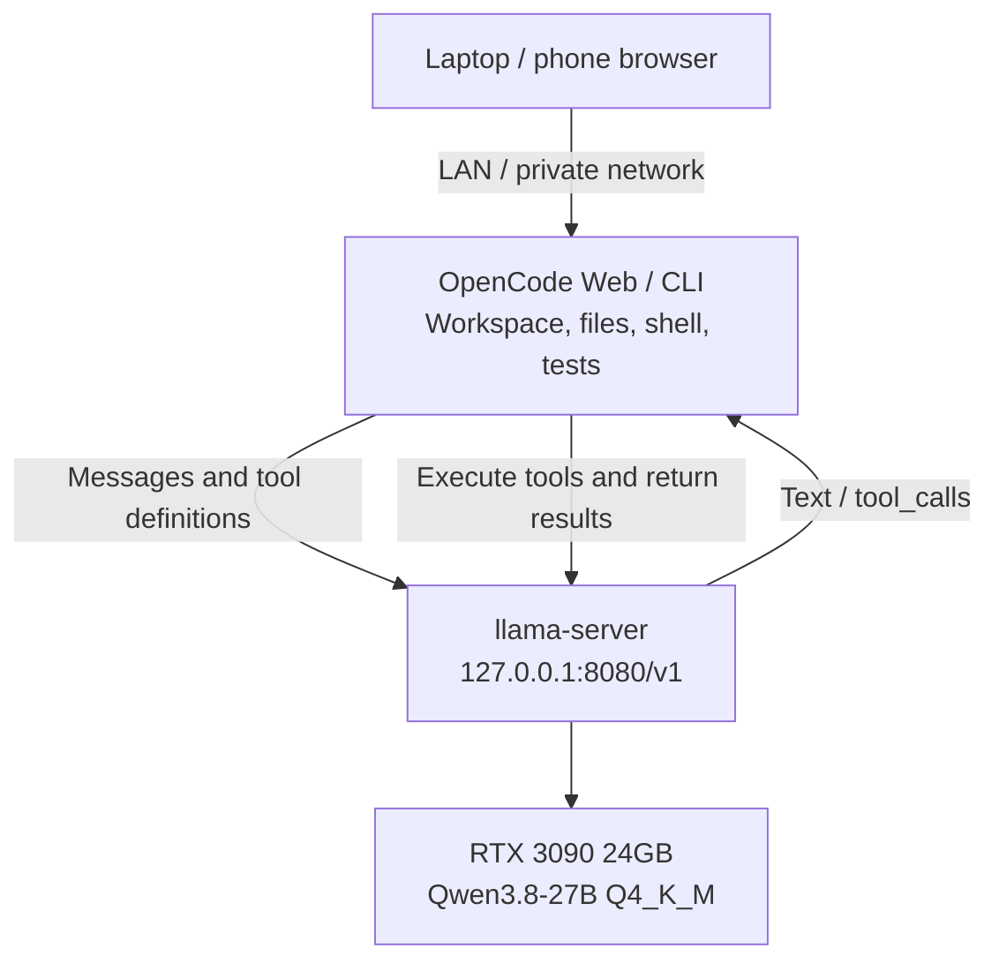

In the [previous post](/en/blog/setup-opencode-remote-web-ide/), we hosted OpenCode on a machine that stays running and connected to the same agent workspace from a laptop or phone. This time, we moved inference onto that machine too: **Qwen3.8-27B Q4_K_M on one RTX 3090 24GB**, exposed to OpenCode through a local API.

The question I cared about was whether this combination could finish useful coding work. Loading the model, chatting, and receiving a tool call are only the beginning.

Our measured answer: **it can solve bounded coding tasks with clear acceptance criteria, but this configuration still needs independent tests and code review.** Three of four first-attempt candidate implementations passed all predefined independent checks. Only two completed editing, testing, and final handoff within eight minutes. We also recorded failures, a timeout, and defects that green tests missed.

These runs took place on **September 29, 2026, in America/Los_Angeles**. Capacity, throughput, and coding quality are reported separately. We did not run a controlled comparison against another model.

## Hardware and settings

| Component | Tested configuration |
| --- | --- |
| System | Ubuntu, Linux x86-64 |
| GPU | NVIDIA RTX 3090, 24GB VRAM |
| CPU / RAM | Ryzen 7 5800X / 64GB |
| Weights | Qwen3.8-27B, Q4_K_M, 16,810,714,464 bytes |
| Serving engine | llama.cpp **b11146**, prebuilt CUDA 12.8 runtime |
| Agent | OpenCode **2.0.20** |
| Context / per-response output limit | **131,072 / 8,192 tokens**; input and output share context |
| KV cache | **q8_0** for both K and V |
| GPU / concurrency | All model layers on GPU; **one generation slot** |
| Other settings | Flash attention; batch 512 / microbatch 256 |
| Thinking for coding tasks | Enabled, **medium** effort |

We used the GGUF behind [Ollama's `qwen3.8:27b-q4_K_M` tag](https://ollama.com/library/qwen3.8:27b-q4_K_M), loaded directly by llama-server. **No Ollama service was installed.** The [official Qwen model card](https://huggingface.co/Qwen/Qwen3.8-27B) provides model background. We loaded no vision projector and tested text and tools only.

Q4_K_M describes weight quantization; q8_0 describes the KV cache. The roughly 16.8GB weight file also needs memory for caches, compute buffers, and desktop applications. File size alone is not the VRAM requirement.

## How the pieces connect



OpenCode owns file access, tool execution, tests, and session management. llama-server handles inference. Returning a `tool_calls` object does not execute a command by itself.

OpenCode and the model ran on the same host, so the model API stayed on loopback. If you reuse the previous post's Web setup, give OpenCode another port, such as **4096**: **8080 now belongs to the model server**. Remote browsers connect to OpenCode; the provider's `baseURL` remains the model address as seen from the OpenCode host. If OpenCode runs on another machine or inside a container, its `127.0.0.1` points somewhere else, and you need a private connection to the GPU host.

## Deploy llama-server

A small [configuration and measurement kit](/experiments/qwen3.8-27b-3090/reproduction-kit.zip) accompanies this post. It contains a downloader with SHA-256 checks, full launch settings, the tested OpenCode configuration, a throughput script, and measurements. **Model weights are not included.** Downloads total roughly 17.6GB, with additional disk space needed to extract the runtime.

With an NVIDIA driver, `curl`, `unzip`, Python 3, and a working Ubuntu user session available:

```bash
mkdir -p ~/local-qwen && cd ~/local-qwen
curl -fL https://zjshen14.github.io/experiments/qwen3.8-27b-3090/reproduction-kit.zip -o kit.zip
unzip kit.zip
bash setup.sh
./run-server.sh
```

The setup script downloads and verifies the original GGUF and [llama.cpp b11146 CUDA 12.8 release archives](https://github.com/ggml-org/llama.cpp/releases/tag/b11146). Using the prebuilt runtime avoids compiling a CUDA development toolchain locally. The script does not install a system service or change your global OpenCode configuration.

These are the core launch options; the kit's `run-server.sh` includes the remaining sampling, thread, and cache settings:

```bash
llama-server \
  --model models/Qwen3.8-27B-Q4_K_M.gguf \
  --alias qwen3.8-27b \
  --host 127.0.0.1 --port 8080 \
  --ctx-size 131072 --parallel 1 \
  --n-gpu-layers all --fit off \
  --flash-attn on \
  --cache-type-k q8_0 --cache-type-v q8_0 \
  --batch-size 512 --ubatch-size 256 \
  --jinja --reasoning-format deepseek --reasoning-preserve \
  --no-context-shift --no-mmproj --metrics
```

This is an options excerpt. The packaged launcher sets the shared-library paths and invokes the actual binary. If other applications need VRAM, stop the server and use `MODEL_CONTEXT=65536 ./run-server.sh` for 64K capacity. All measurements in this post used the 128K configuration.

Once the foreground server is ready, check its API from another terminal:

```bash
curl -f http://127.0.0.1:8080/health
curl -f http://127.0.0.1:8080/v1/chat/completions \
  -H 'Content-Type: application/json' \
  -d '{"model":"qwen3.8-27b","messages":[{"role":"user","content":"Reply with OK."}],"max_tokens":64,"chat_template_kwargs":{"enable_thinking":false}}'
```

Our loopback API had no authentication and needed no real API key. A client that requires a value can use a nonsecret placeholder such as `local`; that is not access control. Do not expose this unauthenticated port directly to the public internet.

To keep it running after closing the launching terminal, stop the foreground server first, then start a transient user service:

```bash
mkdir -p logs
systemd-run --user --collect --unit=qwen-local \
  --property="WorkingDirectory=$PWD" \
  --property="StandardOutput=append:$PWD/logs/server.log" \
  --property="StandardError=append:$PWD/logs/server.log" \
  "$PWD/run-server.sh"
# Stop: systemctl --user stop qwen-local
```

This service must be started again after reboot. Survival after logging out of the entire user session depends on user-manager configuration and was not tested here.

## Connect OpenCode

The following configuration was **verified with OpenCode 2.0.20**. Use a project-root `opencode.json`, or merge its provider into an existing global configuration at `~/.config/opencode/opencode.json`.

```json
{
  "$schema": "https://opencode.ai/config.json",
  "model": "local-qwen/qwen3.8-27b",
  "providers": {
    "local-qwen": {
      "name": "Local Qwen",
      "package": "@opencode/ai/providers/openai-compatible",
      "settings": {
        "baseURL": "http://127.0.0.1:8080/v1"
      },
      "models": {
        "qwen3.8-27b": {
          "name": "Qwen3.8 27B — 128K",
          "capabilities": {
            "tools": true,
            "input": ["text"],
            "output": ["text"]
          },
          "limit": { "context": 131072, "output": 8192 },
          "compatibility": { "reasoningField": "reasoning_content" },
          "body": {
            "chat_template_kwargs": {
              "enable_thinking": true,
              "reasoning_effort": "medium"
            }
          }
        }
      }
    }
  }
}
```

Match the configuration to your version. At writing time, the [online OpenCode provider guide](https://opencode.ai/docs/providers/#custom-provider) still shows `provider` / `npm` / `options`, while our tested 2.0.20 configuration uses `providers` / `package` / `settings`. Do not combine the two structures; check your installed version's schema if it differs.

Start the model service, then restart OpenCode. Our installation also reloaded this configuration with `opencode reload`. Existing sessions may retain the previous model; select `local-qwen/qwen3.8-27b` through `/models`. For Web access, launch from the target project:

```bash
export OPENCODE_SERVER_PASSWORD='replace-with-a-strong-password'
opencode web --hostname 127.0.0.1 --port 4096
```

Use the previous post's network setup for remote access. This example starts on loopback; LAN access requires the binding and authentication configuration described there.

Verify an ordinary reply first. Then create a harmless fixture and ask the agent to **use its `read` tool** and return the contents. Both checks passed in our installation. Server checks also passed a synthetic tool-call round trip and streamed tool calls, verifying more than a working chat endpoint.

## Throughput: large prompts fit, but fresh processing takes time

Every row below used the same **131,072-token server capacity**; only actual input length changed. The main timing runs disabled thinking and used synthetic source listings, temperature 0, and seed 1234. Fresh requests generated 512 tokens; cached continuations generated 256. Generated source was never executed.

| Actual input | Fresh prompt processing | Generation | First token, fresh | First token, cached |
| --- | ---: | ---: | ---: | ---: |
| 2,073 tokens | 999 tokens/s | **36.4 tokens/s** | 2.75 s | 0.46 s |
| 16,378 tokens | 995 tokens/s | **33.5 tokens/s** | 17.00 s | 0.47 s |
| 65,537 tokens | 795 tokens/s | **25.9 tokens/s** | 83.41 s | 0.51 s |
| 120,011 tokens | 656 tokens/s | **20.9 tokens/s** | 183.01 s | 0.63 s |

Generation uses the server's decode timing and excludes initial prompt processing. First-token latency comes from the streaming HTTP client and includes tokenization and processing overhead. The 2K row is the median of three fresh requests; each larger input had one fresh request and one continuation. These are measurements, not reliability intervals. Download the [raw records](/experiments/qwen3.8-27b-3090/throughput-results.json) and [summary](/experiments/qwen3.8-27b-3090/throughput-summary.json).

Cached continuations reused nearly the whole prefix and evaluated only **27–28 new input tokens**. This cut the initial wait, while retained long context continued to slow sustained generation. Stable session prefixes can therefore help coding-agent latency; repeatedly sending unrelated large prompts incurs fresh processing costs.

A separate capacity check successfully processed **119,968 input tokens**, retrieved three widely separated values, and answered a follow-up. That establishes capacity and retrieval for that synthetic test. **It does not establish coding quality at 120K context.**

GPU samples taken every two seconds during the throughput run showed peak total use of **22,162 MiB**, minimum free memory of **1,943 MiB**, and a maximum temperature of **85°C**. These include desktop GPU use. The configuration fit on this card, with limited headroom for another model or GPU-heavy workload.

To repeat the throughput run against an idle server, choose a new output directory:

```bash
python3 benchmark_throughput.py --report-dir reports/throughput-new-run
```

The packaged script measures single-request performance, excluding model loading time and multi-user throughput. A separate short request with medium thinking generated about **35.7 tokens/s**, including reasoning tokens. That is not a rate of usable code production.

## Coding tasks: check both the patch and the completed workflow

We prepared four small Python repositories with written acceptance contracts and three fixed public tests each. The evaluator prepared ten independent test methods per task before its attempt and kept them outside the agent workspace. Their results were never used to coach the model.

Each first attempt started a fresh session and ran serially with an eight-minute deadline. Repository file tools and a narrow allowlist of local test commands were available; network tools, subagents, and cloud fallback were disabled. All four used **medium thinking and an 8,192-token per-response output limit**.

| Task | Independent checks, before → after | Time | Agent-added tests | Outcome |
| --- | --- | --- | ---: | --- |
| Expiring LRU cache | 0/10 → **10/10** | ≈3m 07s | 23 | Completed; strongest result |
| CSV ledger and refunds | 1/10 → **10/10** | ≈5m 44s | 40 | Completed; review found boundary and error-handling gaps |
| Incremental build planner | 1/10 → **1/10** | 3m 58s | 0 | No patch; exhausted one response's output allowance |
| Atomic SQLite transfers | 1/10 → **10/10** | 8m deadline | 11 | Candidate passed checks; final test rerun and handoff unfinished |

The first-attempt candidates passed **31/40 independent test methods**, including one build-planner method that already passed before the attempt. These are not forty equally difficult coding tasks or a general success rate. Cache and ledger durations were recovered from saved timestamps and are approximate. Infrastructure-only aborted launches were excluded from model scores.

The evaluator later ran public and agent-added tests: cache **26/26**, ledger **43/43**, and wallet **14/14** passed. Wallet's successful rerun happened after the agent timed out, so it does not make that attempt a completed handoff. The unchanged build planner still failed its three public tests. The [coding summary](/experiments/qwen3.8-27b-3090/coding-summary.json) preserves these distinctions.

### Failure one: reasoning consumed the 8K response budget

The build-planner agent read the repository and made no edits. Its final response had `finish_reason: length`, **8,192 generated tokens**, and only reasoning content. OpenCode exited with status zero without a final answer.

That request had roughly **4,985 input tokens**, nowhere near 128K. More context would not fix this failure. Thinking, response allowance, actual file changes, and final handoff status all need attention. The [termination metadata](/experiments/qwen3.8-27b-3090/buildplan-termination.json) records what happened.

A separate diagnostic restarted from the original repository with thinking disabled, keeping the prompt, output allowance, and deadline unchanged and providing no independent-test feedback. It completed in **5m 40s**, passed **9/10 independent checks**, and passed **47/47 public plus agent-added tests**. The missed check concerned `load_manifest()` returning tuples where its original API returned lists; the agent's own test expected tuples.

The diagnostic does not replace the first attempt. One additional sample at temperature 1 cannot show that disabling thinking is universally better. It shows that this task merits further tuning under the same acceptance criteria.

### Failure two: many new tests still missed important boundaries

Review uncovered several useful examples:

- **Decimal precision in the ledger.** Default 28-digit precision rounded a valid large amount when adding `0.01`, violating the no-rounding contract. An I/O error during file iteration could also escape as a traceback.
- **Sequential concurrency tests in the wallet.** Agent-written tests submitted one future and immediately waited before submitting the next. They did not overlap requests. The evaluator's separate eight-caller concurrent test passed, but that does not make the agent's test concurrent.
- **SQLite integer overflow.** Crediting two cents to a destination near the signed-integer limit converted the balance to `REAL` while recording success. Rejecting the unrepresentable balance and rolling back would preserve integer cents.

These probes ran after grading and were not added retroactively to the forty predefined checks. They show why test count alone is a weak quality signal. Review found no additional contract defect in the cache, though its expiration cleanup scans the cache and our assessment applies to the small task tested.

## How I would use this setup now

I would use it for bounded fixes and small features with quick feedback: state the acceptance contract, require a patch, run tests, and ask for a clear handoff. In these runs, it navigated multiple files, added regression coverage, and corrected some mistakes it discovered itself.

For longer tasks, watch whether reasoning crowds out output and whether the whole workflow exceeds its deadline. I check the actual diff, independent tests, and final handoff before accepting completion. Numerical boundaries, concurrency, and error handling still deserve review.

We did not measure reliability across seeds, large production repositories, the quality difference between Q4 and higher-precision weights, or actual coding quality at 64K or 128K. Other models remain future candidates; undeployed and untested alternatives are not established upgrades.

This machine now has a useful local environment for coding experiments. The next comparison should retain these tasks and independent checks, add repeated runs, and vary thinking and output allowances.

## Configuration, data, and reproduction materials

- [Configuration and measurement ZIP](/experiments/qwen3.8-27b-3090/reproduction-kit.zip): verified downloads, full launcher, OpenCode configuration, throughput script, and data. It includes neither weights nor the complete coding-task fixtures.
- [Experiment notes](/experiments/qwen3.8-27b-3090/README.txt), [raw throughput records](/experiments/qwen3.8-27b-3090/throughput-results.json), and [coding summary](/experiments/qwen3.8-27b-3090/coding-summary.json). Personal paths and session identifiers were removed from summaries; scores and review probes are retained.
- [Official Qwen model card](https://huggingface.co/Qwen/Qwen3.8-27B), [pinned llama-server documentation](https://github.com/ggml-org/llama.cpp/blob/b11146/tools/server/README.md), and [OpenCode provider documentation](https://opencode.ai/docs/providers/). Upstream sources describe installation and protocols; performance and coding claims come from the attached local records.
