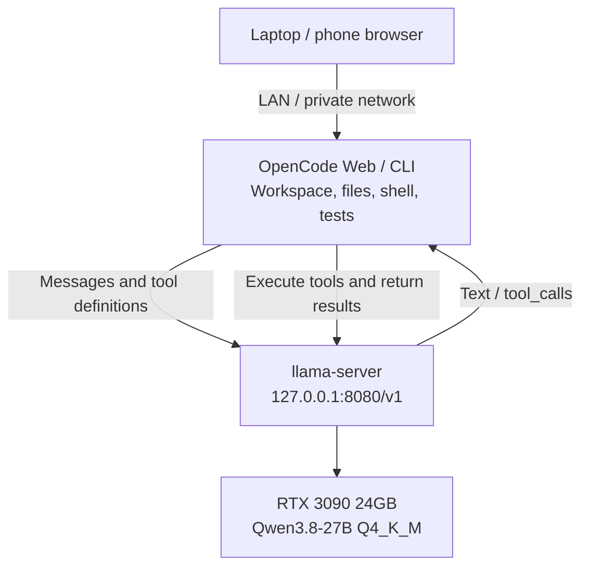

My **RTX 3090** is a leftover from my Ethereum mining days. Running a local model gives it a second life: the same card now powers a coding agent.

The [previous post](/en/blog/setup-opencode-remote-web-ide/) covered accessing one OpenCode workspace from a laptop or phone. This time, I wanted to move inference onto that host too and find out how far the hardware already on hand could take a local AI coding workflow.

We loaded **Qwen3.8-27B Q4_K_M** into the 3090's **24GB of VRAM**, served it through llama.cpp, and connected OpenCode. After checking chat and tool calls, we gave it four small coding tasks.

The results make me want to keep using it: **bounded fixes and small features with clear acceptance criteria can produce useful patches.** Exhausted output budgets, a timeout, and defects missed by tests also showed why independent validation still matters.

I'll start with the measured results, then walk through reproduction. To get straight to the setup, jump to [deployment](#reproduce-the-local-coding-setup).

## What the old card does now

OpenCode owns the workspace and tools: reading files, editing code, running shell commands, and executing tests. llama-server handles inference, connected through a local API.



OpenCode executes the model's `tool_calls` and returns tool results for the next turn. The model API itself does not execute terminal commands.

The host has an **RTX 3090 24GB, Ryzen 7 5800X, and 64GB RAM**. We used **llama.cpp b11146 / CUDA 12.8** and **OpenCode 2.0.20**, placing all model layers on the GPU with one generation slot.

Weights came from [Ollama's `qwen3.8:27b-q4_K_M` tag](https://ollama.com/library/qwen3.8:27b-q4_K_M) and were loaded directly by llama-server, without installing an Ollama service. Only the text model was loaded; vision input was not tested.

Two settings matter throughout this post: **131,072 tokens of context capacity and an 8,192-token per-response output allowance**. Input and output share context, and reasoning consumes the response allowance too. That distinction later explained one of the coding failures.

## Large prompts fit, but fresh processing takes time

With short input, generation reached about **36.4 tokens/s**. At roughly 120K input tokens, it fell to **20.9 tokens/s**, and a fresh request took about **three minutes** to produce its first token.

The model processes the input before it starts generating. As input grows, that initial wait becomes a substantial part of the experience:

| Actual input | Fresh prompt processing | Generation | First token, fresh | First token, cached |
| --- | ---: | ---: | ---: | ---: |
| 2,073 tokens | 999 tokens/s | **36.4 tokens/s** | 2.75 s | 0.46 s |
| 16,378 tokens | 995 tokens/s | **33.5 tokens/s** | 17.00 s | 0.47 s |
| 65,537 tokens | 795 tokens/s | **25.9 tokens/s** | 83.41 s | 0.51 s |
| 120,011 tokens | 656 tokens/s | **20.9 tokens/s** | 183.01 s | 0.63 s |

The last column is particularly relevant to coding sessions. Cached continuations reused almost the entire prefix and processed only **27–28 new input tokens**. Even with roughly 120K context retained, first-token latency fell to **0.63 seconds**. Sustained generation still had to attend to the long context, so it did not regain short-input speed.

This suggests a practical approach: keep stable session prefixes and supply source as needed. Repeatedly opening fresh requests with large inputs incurs the processing cost again.

A separate capacity check processed **119,968 input tokens**, retrieved three widely separated values, and answered a follow-up. It verified capacity for that synthetic retrieval task. Coding quality at the same input length needs its own evaluation.

VRAM was also close to the card's limits. Samples during throughput testing showed peak total use of **22,162 MiB**, minimum free memory of **1,943 MiB**, and a maximum temperature of **85°C**, including desktop GPU use. The configuration fit, with limited headroom for another model or GPU-heavy workload.

<details>
<summary>Timing methodology, sample counts, and source data</summary>

Every row used the same **131,072-token server capacity**, varying only actual input length. Main runs disabled thinking and used synthetic source listings, temperature 0, and seed 1234. Fresh requests generated 512 tokens; continuations generated 256. Generated text was never executed.

Generation uses server decode timing, excluding initial prompt processing. First-token latency uses the streaming HTTP client, including tokenization and processing overhead. The 2K row is the median of three fresh requests; larger inputs had one fresh request and one continuation each. These measurements do not establish reliability intervals. GPU samples were collected every two seconds.

A separate short request with medium thinking generated about **35.7 tokens/s**, including reasoning. Throughput does not directly measure usable code produced per second. The script measures single-request performance, excluding model loading and multi-user throughput.

Download the [measurement records](/experiments/qwen3.8-27b-3090/throughput-results.json) and [summary](/experiments/qwen3.8-27b-3090/throughput-summary.json).

</details>

## The real test: four small coding projects

We prepared four small Python repositories: an expiring cache, a CSV ledger, an incremental build planner, and SQLite transfers. Each had a written acceptance contract, a fresh session, and an eight-minute deadline.

To check more than the agent's own tests, we prepared ten independent test methods per task, kept them outside its workspace, and never fed their results back to the model.

| Task | Independent checks, before → after | Time | Agent-added tests | Outcome |
| --- | --- | --- | ---: | --- |
| Expiring LRU cache | 0/10 → **10/10** | ≈3m 07s | 23 | Completed; strongest result |
| CSV ledger and refunds | 1/10 → **10/10** | ≈5m 44s | 40 | Completed; review found boundary and error-handling gaps |
| Incremental build planner | 1/10 → **1/10** | 3m 58s | 0 | No patch; exhausted one response's output allowance |
| Atomic SQLite transfers | 1/10 → **10/10** | 8m deadline | 11 | Candidate passed checks; final test rerun and handoff unfinished |

**Three candidates passed all predefined independent checks; two completed editing, testing, and final handoff within the deadline.** The wallet candidate passed checks, but the agent timed out before its final test rerun and handoff. Both outcomes matter.

First-attempt candidates passed **31/40 independent test methods**. The build planner made no edits and already passed one method at baseline. Methods also differ in difficulty, so 31/40 should not be interpreted as a general coding success rate.

Two findings were more useful than the aggregate score.

### One failure came from the response budget

The build-planner agent read the repository and never produced a patch. Its final response generated **8,192 tokens**, all reasoning, and ended with `length`. OpenCode exited with status zero without a final answer.

That request had roughly **4,985 input tokens**, far below the 128K limit. Thinking and the response allowance needed attention; increasing context capacity would not resolve an exhausted output budget. The [termination record](/experiments/qwen3.8-27b-3090/buildplan-termination.json) preserves the evidence.

A separate diagnostic restarted from the original repository with thinking disabled, keeping the prompt, allowance, and deadline unchanged. It completed in **5m 40s** and passed **9/10 independent checks**. The remaining failure was `load_manifest()` returning tuples where the original API returned lists; the agent's own test accepted that change too.

The diagnostic is reported separately and does not replace the first attempt. One additional sample at temperature 1 cannot establish that disabling thinking is generally better, but it identifies a setting worth testing further.

### Many new tests still missed defects

The ledger added **40 tests**, passed the predefined independent checks, and had a reasonably clear structure. Further review still found that Python's default 28-digit Decimal precision rounded a valid large amount when adding `0.01`, violating the no-rounding contract. An I/O error during file iteration could also escape as a traceback.

The wallet exposed a different problem: its own concurrency tests submitted one future and immediately waited before submitting the next. Execution was sequential. Our separate eight-caller concurrent test passed, but the agent's tests had not demonstrated overlapping requests.

Review also found that crediting two cents to a destination near SQLite's signed-integer limit converted the balance to `REAL` while recording success. That extreme numerical boundary should be rejected with a rollback.

These probes ran after grading and were not added retroactively to the forty checks. They made me focus on what tests actually cover rather than how many were added. Review found no additional acceptance-contract defect in the cache, though expiration cleanup scans the whole cache and our assessment remains limited to the small task tested.

<details>
<summary>Coding protocol and additional test results</summary>

Each repository had three fixed public tests. Independent checks were prepared before the corresponding attempt; the evaluator did not repair candidate production code. The agent left protected acceptance contracts, public tests, and configurations unchanged.

First attempts ran serially with medium thinking and an 8,192-token per-response output allowance. Repository file tools and a narrow allowlist of local test commands were available; network tools, subagents, and cloud fallback were disabled. Infrastructure-only aborted launches were excluded from scores. Cache and ledger durations were recovered from event records and are approximate.

The evaluator subsequently ran public and agent-added tests: cache **26/26**, ledger **43/43**, and wallet **14/14** passed. Wallet's green rerun occurred after the agent timed out. The original build planner still failed its three public tests. The thinking-disabled diagnostic passed **47/47** public and agent-added tests, while retaining the independent-check failure described above.

These were four deliberately bounded Python repositories. We did not measure reliability across seeds, large production repositories, Q4 versus higher-precision weights, or coding quality at 64K / 128K. No controlled model comparison was performed. The [coding summary](/experiments/qwen3.8-27b-3090/coding-summary.json) retains scores and review probes.

</details>

## How I would keep using it

I would give it bounded fixes and small features, state the acceptance criteria first, and inspect the actual diff, independent tests, and final handoff. It demonstrated the ability to edit across files, add regression coverage, and correct some mistakes found during its own checks.

For longer tasks, I would watch whether reasoning crowds out output and whether the workflow times out. Numerical boundaries, concurrency, and error handling still deserve review. The next experiment should retain the same tasks and checks, add repeated runs, and compare thinking settings and response allowances.

From Ethereum mining to local coding, this 3090 has found another useful job. If similar hardware is already on hand, a small task with clear acceptance criteria is a practical way to see what it can contribute to your workflow.

## Reproduce the local coding setup

Here is the deployment path we used. The [download kit](/experiments/qwen3.8-27b-3090/reproduction-kit.zip) contains the full configuration. Essential launch and verification steps are below, with additional settings available in expandable sections.

### 1. Start the model service

On Ubuntu, prepare an NVIDIA driver, `curl`, `unzip`, Python 3, and a working user session, then run:

```bash
mkdir -p ~/local-qwen && cd ~/local-qwen
curl -fL https://zjshen14.github.io/experiments/qwen3.8-27b-3090/reproduction-kit.zip -o kit.zip
unzip kit.zip
bash setup.sh
./run-server.sh
```

`setup.sh` downloads and verifies the GGUF and [llama.cpp b11146 CUDA 12.8 release archives](https://github.com/ggml-org/llama.cpp/releases/tag/b11146). Downloads total roughly **17.6GB**, plus extracted runtime space; weights are not inside the ZIP. Prebuilt binaries avoid compiling a CUDA development toolchain. The script installs no system service and makes no global OpenCode configuration changes.

Once the service is ready, verify the API from another terminal:

```bash
curl -f http://127.0.0.1:8080/health
curl -f http://127.0.0.1:8080/v1/chat/completions \
  -H 'Content-Type: application/json' \
  -d '{"model":"qwen3.8-27b","messages":[{"role":"user","content":"Reply with OK."}],"max_tokens":64,"chat_template_kwargs":{"enable_thinking":false}}'
```

The server listens on `127.0.0.1:8080`, and local requests need no real API key. A client requiring a value can use a nonsecret placeholder such as `local`, but that is not access control. Keep this unauthenticated endpoint on loopback.

<details>
<summary>Full experiment settings, launch options, and background service</summary>

| Component | Tested configuration |
| --- | --- |
| System | Ubuntu, Linux x86-64 |
| GPU | NVIDIA RTX 3090, 24GB VRAM |
| CPU / RAM | Ryzen 7 5800X / 64GB |
| Weights | Qwen3.8-27B, Q4_K_M, 16,810,714,464 bytes |
| Serving engine | llama.cpp **b11146**, prebuilt CUDA 12.8 runtime |
| Agent | OpenCode **2.0.20** |
| Context / per-response output limit | **131,072 / 8,192 tokens**; input and output share context |
| KV cache | **q8_0** for both K and V |
| GPU / concurrency | All model layers on GPU; **one generation slot** |
| Other settings | Flash attention; batch 512 / microbatch 256 |
| Thinking for coding tasks | Enabled, **medium** effort |

Q4_K_M describes weight quantization; q8_0 describes KV-cache quantization. Beyond the roughly 16.8GB weight file, VRAM is needed for caches, compute buffers, and desktop applications. The kit's `run-server.sh` supplies the full command; these are its core options:

```bash
llama-server \
  --model models/Qwen3.8-27B-Q4_K_M.gguf \
  --alias qwen3.8-27b \
  --host 127.0.0.1 --port 8080 \
  --ctx-size 131072 --parallel 1 \
  --n-gpu-layers all --fit off \
  --flash-attn on \
  --cache-type-k q8_0 --cache-type-v q8_0 \
  --batch-size 512 --ubatch-size 256 \
  --jinja --reasoning-format deepseek --reasoning-preserve \
  --no-context-shift --no-mmproj --metrics
```

The packaged script sets library paths and invokes the actual binary. If other applications need VRAM, stop the server and use `MODEL_CONTEXT=65536 ./run-server.sh` for 64K capacity. All measurements in this post used 128K capacity.

To survive closing the launching terminal, stop the foreground server first and run:

```bash
mkdir -p logs
systemd-run --user --collect --unit=qwen-local \
  --property="WorkingDirectory=$PWD" \
  --property="StandardOutput=append:$PWD/logs/server.log" \
  --property="StandardError=append:$PWD/logs/server.log" \
  "$PWD/run-server.sh"
# Stop: systemctl --user stop qwen-local
```

This is a transient user service that must be started again after reboot. Survival after logging out of the entire user session depends on user-manager configuration and was not tested here.

</details>

### 2. Configure OpenCode

Place the kit's `opencode.json` in your project root, or merge its provider into `~/.config/opencode/opencode.json`. This configuration was verified with **OpenCode 2.0.20**: model ID `local-qwen/qwen3.8-27b`, API base URL `http://127.0.0.1:8080/v1`.

<details>
<summary>Full OpenCode provider configuration</summary>

```json
{
  "$schema": "https://opencode.ai/config.json",
  "model": "local-qwen/qwen3.8-27b",
  "providers": {
    "local-qwen": {
      "name": "Local Qwen",
      "package": "@opencode/ai/providers/openai-compatible",
      "settings": {
        "baseURL": "http://127.0.0.1:8080/v1"
      },
      "models": {
        "qwen3.8-27b": {
          "name": "Qwen3.8 27B — 128K",
          "capabilities": {
            "tools": true,
            "input": ["text"],
            "output": ["text"]
          },
          "limit": { "context": 131072, "output": 8192 },
          "compatibility": { "reasoningField": "reasoning_content" },
          "body": {
            "chat_template_kwargs": {
              "enable_thinking": true,
              "reasoning_effort": "medium"
            }
          }
        }
      }
    }
  }
}
```

The tested configuration uses `providers` / `package` / `settings`; the [online provider guide](https://opencode.ai/docs/providers/#custom-provider) has shown `provider` / `npm` / `options`. If your installed version differs, follow its actual schema and avoid combining structures.

</details>

Start the model service, then restart OpenCode. Our installation also reloaded the configuration with `opencode reload`. Existing sessions may retain their previous model; choose `local-qwen/qwen3.8-27b` through `/models`.

For the previous post's Web workflow, launch from your project and choose a different port:

```bash
export OPENCODE_SERVER_PASSWORD='replace-with-a-strong-password'
opencode web --hostname 127.0.0.1 --port 4096
```

**8080 serves the model; 4096 serves OpenCode.** On the same machine, the provider uses loopback while remote browsers connect to OpenCode. If OpenCode runs on another host or inside a container, `127.0.0.1` points to that environment and needs replacing with a private connection to the GPU host. See the [previous post](/en/blog/setup-opencode-remote-web-ide/) for network binding and authentication.

### 3. Verify tools, then try a task

Check an ordinary reply first, then create a harmless fixture and ask the agent to **use its `read` tool** and return the contents. Both checks passed here, along with synthetic tool-call round trips and streamed tool calls at the server.

To repeat throughput measurements, keep the server idle and choose a new output directory:

```bash
python3 benchmark_throughput.py --report-dir reports/throughput-new-run
```

Then try a bounded task of your own and validate it with independent tests and review.

## Configuration, data, and reproduction materials

- [Configuration and measurement ZIP](/experiments/qwen3.8-27b-3090/reproduction-kit.zip): verified downloads, full launcher, OpenCode configuration, throughput script, and data. It includes neither weights nor the complete coding-task fixtures.
- [Experiment notes](/experiments/qwen3.8-27b-3090/README.txt), [throughput measurements](/experiments/qwen3.8-27b-3090/throughput-results.json), and [coding summary](/experiments/qwen3.8-27b-3090/coding-summary.json). Experiment dates, absolute timestamps, timezones, personal paths, and session identifiers were removed from attachments; measurements, scores, and review probes are retained.
- [Official Qwen model card](https://huggingface.co/Qwen/Qwen3.8-27B), [pinned llama-server documentation](https://github.com/ggml-org/llama.cpp/blob/b11146/tools/server/README.md), and [OpenCode provider documentation](https://opencode.ai/docs/providers/). Upstream sources describe installation and protocols; performance and coding claims come from the attached local records.
