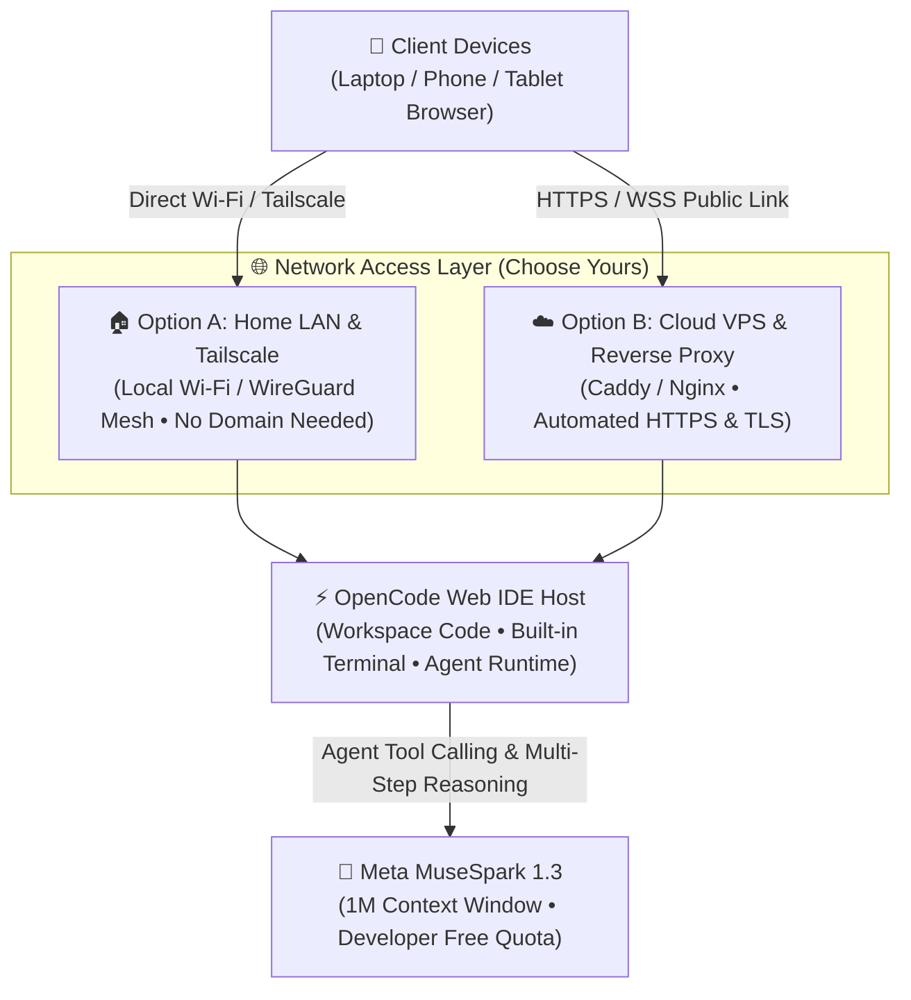

In our recent **Agent Hosting** project, we encountered a universal developer dilemma: **How can we give autonomous AI agents a dedicated, 24/7 environment that doesn't depend on a single local laptop, while remaining instantly accessible from any browser on any device?**

Running long-horizon agents locally has obvious bottlenecks:
- Close your laptop lid, and a 40-minute agent workflow terminates mid-execution.
- While on the go, if you want to inspect agent progress or tweak prompts, you rarely have your full development toolchain installed on your mobile phone or lightweight tablet.
- API keys, dependencies, and environment configurations quickly drift across multiple devices.

To solve this, we set up a hosted Web IDE around **OpenCode**, designed to run smoothly whether on a **cloud VPS or a local home workstation / Mac mini / homelab server**. More importantly, Meta's latest frontier agent model—**MuseSpark 1.3 (Muse Spark 1.3)**—is currently **free on OpenCode for a limited time** (Muse Spark 1.3 Contributor Free), with no API key required. Tailor-made for long-horizon multi-step agentic execution with a massive **1-million-token context window**, MuseSpark 1.3 cuts token consumption by ~25% and tool calls by ~20% compared to previous generations, making it feasible to run end-to-end coding agents at virtually zero cost.

In this guide, we share our setup blueprint: **whether you own a custom domain or not, and whether you are connecting over your home Wi-Fi from the couch with your phone/laptop or hosting 24/7 on a cloud VPS**, you can quickly stand up a personal agent workbench.

---

## Architecture Overview

This architecture supports two practical connection topologies depending on your hardware and network setup:



### Why Care About HTTP / WebSocket Capabilities?
Running a modern Web IDE in the browser requires more than simple static HTTP request handling:
1. **Persistent WebSocket Streams**: The interactive terminal, Language Server Protocol (LSP) diagnostics, and real-time agent output streams rely entirely on WebSocket connections. Without proper protocol upgrades, browser terminals fail with instant connection drops.
2. **Multi-Device Mobility**: Once reachable, whether you are on your laptop in your home office or on your phone/tablet lounging on the couch, all devices seamlessly connect to the same workspace and ongoing agent session.

---

## Step 1: Launch OpenCode on Your Host

Install and start OpenCode on your target machine (your Linux/macOS/Windows WSL2 desktop, or a cloud VPS).

> ⚠️ **Set a password before exposing anything**: the OpenCode web UI can run arbitrary shell commands on the host, so anyone who can open the page effectively has a terminal on your machine. Whether on a LAN or the public internet, enable HTTP Basic auth with the `OPENCODE_SERVER_PASSWORD` environment variable (username defaults to `opencode`; change it with `OPENCODE_SERVER_USERNAME`).

### 1. Select the Host Binding Address
`opencode web` starts the server with the browser UI and uses the **current directory** as the workspace (note: `opencode serve` starts a headless API server only, not the Web IDE). `cd` into your project first, then pick a bind address:
- **Home LAN / Multi-device Access**: Bind to `0.0.0.0` so other devices on your home network can reach it:
  ```bash
  cd /path/to/your/workspace
  export OPENCODE_SERVER_PASSWORD='use-a-strong-password'
  opencode web --hostname 0.0.0.0 --port 8080
  ```
  On startup OpenCode prints both the local URL and the network URL (e.g., `http://192.168.1.100:8080`).
- **Cloud VPS Behind a Local Reverse Proxy**: Bind exclusively to `127.0.0.1` so that traffic must route through your frontend proxy:
  ```bash
  cd /home/ubuntu/workspace
  export OPENCODE_SERVER_PASSWORD='use-a-strong-password'
  opencode web --hostname 127.0.0.1 --port 8080
  ```

### 2. Configure a Background Daemon (Linux systemd Example)
To ensure the IDE survives terminal disconnects or system reboots, create a simple **systemd** service.

First, put secrets in a root-only environment file instead of the world-readable unit file (if you bring your own Meta API key in Step 3, it goes here too):

```bash
sudo tee /etc/opencode.env >/dev/null <<'EOF'
OPENCODE_SERVER_PASSWORD=use-a-strong-password
EOF
sudo chmod 600 /etc/opencode.env
```

Then create the service:

```ini
# /etc/systemd/system/opencode.service
[Unit]
Description=OpenCode Web IDE Server
After=network.target

[Service]
Type=simple
User=ubuntu
WorkingDirectory=/home/ubuntu/workspace
EnvironmentFile=/etc/opencode.env
# Cloud VPS + reverse proxy: keep 127.0.0.1; home LAN direct access: change to 0.0.0.0
# Check the actual binary path with `which opencode`
ExecStart=/usr/local/bin/opencode web --hostname 127.0.0.1 --port 8080
Restart=always
RestartSec=5

[Install]
WantedBy=multi-user.target
```

Enable and start the service:
```bash
sudo systemctl daemon-reload
sudo systemctl enable --now opencode
sudo systemctl status opencode
```

---

## Step 2: Network Access Setup (Choose What Fits You)

**Not everyone owns a custom public domain, and you do not need one to get started.** A home local area network (LAN) is often the most practical and enjoyable setup. Pick one of the two approaches below:

### Approach A: Home LAN Direct Access (Zero Cost, No Domain Required)

If you have a powerful desktop or Mac mini in your home office and want to connect from your laptop, iPad, or phone on the couch or in bed:

1. **Find Your Host's Local IP**:
   - On Linux / macOS, run `ifconfig` or `ip route` (e.g., `192.168.1.100`);
   - Or use its local mDNS hostname (e.g., `macmini.local` or `homelab.local`).
2. **Open in Any Device Browser**:
   - Connect your phone or laptop to the same home Wi-Fi;
   - Navigate to:
     ```text
     http://192.168.1.100:8080
     # or
     http://homelab.local:8080
     ```
   - Your browser will show a login prompt: enter username `opencode` and the password from Step 1;
   - Done! Zero domain costs, sub-millisecond latency, and traffic never leaves your home network.

> 💡 **Want Remote Access Away from Home Without Buying a Domain? Use Tailscale!**  
> If you want to connect to your home OpenCode instance while traveling without buying a domain or setting up router port forwarding, **Tailscale** is the gold standard (free for personal use):  
> Run `tailscale up` on your home computer, and install the Tailscale app on your phone and laptop. Tailscale creates an end-to-end encrypted WireGuard mesh and gives your machine a static private IP (e.g., `100.x.y.z`). From any cellular network or coffee shop Wi-Fi, open `http://100.x.y.z:8080` to securely access your home IDE.

---

### Approach B: Cloud VPS + Reverse Proxy (For Users with a Domain)

If you rent a cloud VPS and already own a domain (e.g., `ide.example.com`), configuring a reverse proxy provides automatic SSL certificates and standard HTTPS port 443 access:

#### Option 1: Using Caddy (Recommended for Zero-Config Automated HTTPS)
```text
# /etc/caddy/Caddyfile
ide.example.com {
    reverse_proxy 127.0.0.1:8080
}
```

Reload Caddy with `sudo systemctl reload caddy`, and Let's Encrypt certificates are provisioned automatically.

#### Option 2: Using Nginx (Standard Production Setup)
```nginx
# /etc/nginx/sites-available/opencode.conf
server {
    listen 80;
    server_name ide.example.com;
    return 301 https://$host$request_uri;
}

server {
    listen 443 ssl http2;
    server_name ide.example.com;

    # SSL Certificate Paths
    ssl_certificate /etc/letsencrypt/live/ide.example.com/fullchain.pem;
    ssl_certificate_key /etc/letsencrypt/live/ide.example.com/privkey.pem;

    # Accommodate large asset uploads and long-running agent tasks
    client_max_body_size 100M;
    proxy_read_timeout 86400s;
    proxy_send_timeout 86400s;

    location / {
        proxy_pass http://127.0.0.1:8080;

        # Crucial for Web IDE Terminal & LSP WebSockets
        proxy_http_version 1.1;
        proxy_set_header Upgrade $http_upgrade;
        proxy_set_header Connection "upgrade";

        # Forward Client Headers
        proxy_set_header Host $host;
        proxy_set_header X-Real-IP $remote_addr;
        proxy_set_header X-Forwarded-For $proxy_add_x_forwarded_for;
        proxy_set_header X-Forwarded-Proto $scheme;
    }
}
```

Validate and reload Nginx:
```bash
sudo nginx -t && sudo systemctl reload nginx
```
You can now open `https://ide.example.com` in your browser, where OpenCode's login prompt will appear.

> ⚠️ The reverse proxy **does not authenticate anyone**; it simply forwards public traffic to OpenCode. Make sure `OPENCODE_SERVER_PASSWORD` from Step 1 is in effect (you should get a login prompt), otherwise you have published a server terminal to the internet.

---

## Step 3: Plugging in Meta MuseSpark 1.3 Developer Free Quota

An agent workspace is only as capable as the models driving it.

Released in September 2026, **Meta's MuseSpark 1.3** is specifically engineered for long-horizon autonomous tasks and coding workflows:
- **Agentic Resilience**: Handles multi-step planning within a single persistent thread, autonomously discovering missing context and invoking tools.
- **Superior Efficiency**: Consumes ~25% fewer tokens and requires ~20% fewer tool invocations on coding benchmarks compared to Muse 1.2.
- **1-Million Context Window**: Accommodates entire codebases, docs, and sprawling execution traces without truncation.
- **How to Use It for Free**: **OpenCode Zen**, OpenCode's built-in model service, offers **Muse Spark 1.3 Contributor Free** at no cost for a limited time. Inside OpenCode it works **with no sign-up and no API key**.

> ⚠️ **The catch**: Contributor Free is part of Meta's Contributor program. You grant Meta **permission to use your prompts and completions to train future models**. It's great for personal experiments and open-source work, but don't feed it company code, secrets, or private data. It is also **free for a limited time**; check the [OpenCode Zen docs](https://opencode.ai/docs/zen/) for the current terms.

### 1. Zero Config: Pick the Free Model (Recommended)
When no API key is configured, OpenCode automatically loads the free models from OpenCode Zen, so there is **nothing to set up**:

1. Open the Web IDE and pick **Muse Spark 1.3 Contributor Free** in the model selector (or type `/models` in the chat box);
2. Send a message, e.g. ask the agent to read and summarize a file in your workspace. A proper reply with a tool call means the model and agent environment are connected.

To make it the default on every start, put this in your workspace root (or the global config at `~/.config/opencode/opencode.json`):

```json
{
  "$schema": "https://opencode.ai/config.json",
  "model": "opencode/muse-spark-1.3-contributor-free"
}
```

You can also confirm the model is available from a terminal:

```bash
opencode models | grep muse-spark
```

### 2. Advanced: Bring Your Own Meta API Key
If you don't want your data used for training, or you need steadier capacity, get an API key from the [Meta developer platform](https://dev.meta.ai/). OpenCode ships a built-in `meta` provider, so no custom provider config is needed. The models are:

- `meta/muse-spark-1.3`: standard tier, $1.25 input / $4.25 output per 1M tokens; data is not used for training;
- `meta/muse-spark-1.3-contributor`: Meta's official Contributor discount, $0.10 input / $0.20 output per 1M tokens; also grants Meta training rights.

Append the key to the `/etc/opencode.env` file from Step 1 and restart the service:

```bash
echo 'META_MODEL_API_KEY=your-meta-api-key' | sudo tee -a /etc/opencode.env >/dev/null
sudo systemctl restart opencode
```

Then select `meta/muse-spark-1.3` in the model selector.

---

## Step 4: Multi-Device Workflow: Phone + Laptop Synergy

Once configured, the real superpower is seamless mobility across screens:

1. **Primary Workspace (Laptop Desk Setup)**:
   Open the IDE in Chrome or Safari (either via LAN `http://192.168.1.100:8080` or your cloud URL). You get full code editing, LSP diagnostics, git staging, and diff inspection just like a native desktop IDE. Because all heavy compilation and LLM reasoning run on the host machine, your laptop runs silently, produces zero fan noise, and maintains all-day battery life.
2. **Headless Agent Runs (Host-Side Execution)**:
   Launch background agents, extensive test suites, or documentation scrapers inside the integrated terminal. Shut your laptop lid and step away—the host continues executing uninterrupted.
3. **Couch & Bedside Check-Ins (Phone / Tablet)**:
   Lounging on the couch or in bed with only your phone or iPad? As long as you are connected to the same home Wi-Fi (or via Tailscale), you can open the Web IDE in Safari in seconds. You can inspect test artifacts, monitor agent output, or type a quick follow-up prompt: *"Fix the failing unit tests from the last run and re-execute."*

---

## Summary & Best Practices

Combining **Your Host Machine (Home Desktop / Homelab / Cloud VPS) + Flexible Network Layer (Home LAN / Tailscale / Reverse Proxy) + Meta MuseSpark 1.3 Free Quota** provides an accessible, zero-friction autonomous agent workbench.

A few quick takeaways:
- **Always Keep Authentication On**: A Web IDE is effectively a remote terminal. Even on a home LAN, keep `OPENCODE_SERVER_PASSWORD` set (guests and every other device on the same Wi-Fi can reach your port). On the public internet or a cloud VPS it is mandatory, and you can add an Nginx IP allowlist (`allow` / `deny`) on top to guard against scanners.
- **Leverage the 1M Window Wisely**: While MuseSpark 1.3 handles 1M tokens with ease, prompt hygiene and selective tool caching ensure you stay within developer free tiers comfortably.

You do not need to buy a domain or pay for expensive cloud servers to begin experimenting. Fire up an old desktop or home Mac, launch OpenCode on your local network, and experience the freedom of multi-device agent development today! Feel free to reach out with any thoughts or questions.
