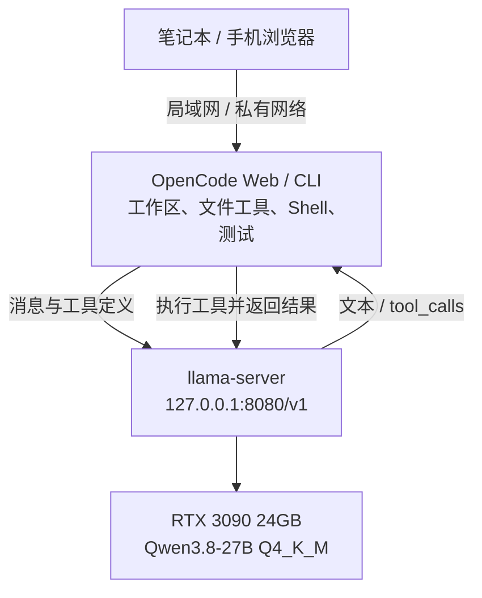

[上一篇](/zh/blog/setup-opencode-remote-web-ide/)把 OpenCode 放到一台持续运行的主机上，让笔记本和手机都能接入同一个 Agent 工作区。这一次，我们把模型也搬到本地：用一张 **RTX 3090 24GB** 运行 **Qwen3.8-27B Q4_K_M**，再让 OpenCode 通过本机 API 调用它。

我最想知道的，是这套组合到底能不能完成实际编码工作。模型加载成功、能聊天、能调用工具，都只是起点。

这轮实测的答案是：**可以完成有明确验收条件的小型代码任务，但当前配置还需要独立测试和代码审查。** 四个首次任务中，三个候选实现通过全部预设独立检查，只有两个在八分钟内完成修改、测试和最终交付。我们也记录了失败、超时，以及绿灯测试没有发现的问题。

以下结果来自这套配置的实际运行。吞吐量、上下文容量和代码质量分开报告；没有与其他模型做同条件对比。

## 这次运行的硬件和配置

| 项目 | 实测配置 |
| --- | --- |
| 系统 | Ubuntu，Linux x86-64 |
| GPU | NVIDIA RTX 3090，24GB 显存 |
| CPU / 内存 | Ryzen 7 5800X / 64GB RAM |
| 权重 | Qwen3.8-27B，Q4_K_M，16,810,714,464 字节 |
| 推理引擎 | llama.cpp **b11146**，CUDA 12.8 预编译运行时 |
| Agent | OpenCode **2.0.20** |
| 上下文 / 单次输出上限 | **131,072 / 8,192 tokens**；输入与输出共享上下文 |
| KV cache | K、V 均为 **q8_0** |
| GPU / 并发 | 全部模型层放到 GPU；**一个生成槽位** |
| 其他参数 | Flash attention；batch 512 / microbatch 256 |
| 编码任务的 thinking | 开启，**medium** |

权重取自 [Ollama 的 `qwen3.8:27b-q4_K_M` 标签](https://ollama.com/library/qwen3.8:27b-q4_K_M)，由独立的 llama-server 加载，**没有安装 Ollama 服务**。模型背景见 [Qwen 官方模型卡](https://huggingface.co/Qwen/Qwen3.8-27B)。本次没有加载视觉投影器，只测试文本和工具调用。

Q4_K_M 是权重量化方式；q8_0 是 KV cache 的量化方式。约 16.8GB 的模型文件还需要额外显存容纳缓存、计算缓冲区和桌面应用，不能只按文件大小判断是否装得下。

## 从浏览器到本地模型的调用链



OpenCode 负责读文件、执行工具、运行测试和管理会话，llama-server 负责推理。模型 API 返回一个 `tool_calls`，并不会自行执行终端命令。

本次 OpenCode 与模型服务在同一台机器上，所以模型 API 保持在 `127.0.0.1`。如果沿用上一篇的 Web 模式，给 OpenCode 换一个端口，例如 **4096**：**8080 现在被模型服务占用**。远程浏览器访问 OpenCode 的地址；Provider 的 `baseURL` 仍是 OpenCode 主机上的模型地址。若 OpenCode 在另一台机器或容器里，`127.0.0.1` 就不再指向这台 GPU 主机，需要另配私有网络连接。

## 部署 llama-server

为方便复现，本文附有一个小型[配置与测量包](/experiments/qwen3.8-27b-3090/reproduction-kit.zip)。里面包含带 SHA-256 校验的下载脚本、完整启动参数、实测 OpenCode 配置、吞吐量脚本和结果；**不包含模型权重**。下载需要约 17.6GB，解压运行时还需要额外磁盘空间。

在准备好 NVIDIA 驱动、`curl`、`unzip`、Python 3 和正常的 Ubuntu 用户会话后：

```bash
mkdir -p ~/local-qwen && cd ~/local-qwen
curl -fL https://zjshen14.github.io/experiments/qwen3.8-27b-3090/reproduction-kit.zip -o kit.zip
unzip kit.zip
bash setup.sh
./run-server.sh
```

`setup.sh` 下载并验证原实验使用的 GGUF 和 [llama.cpp b11146 CUDA 12.8 发布包](https://github.com/ggml-org/llama.cpp/releases/tag/b11146)。这条路线使用预编译运行时，无需本机编译 CUDA 开发工具链。它不会安装系统服务或改动 OpenCode 全局配置。

完整启动配置的核心部分如下；其余采样、线程与缓存参数见包内 `run-server.sh`：

```bash
llama-server \
  --model models/Qwen3.8-27B-Q4_K_M.gguf \
  --alias qwen3.8-27b \
  --host 127.0.0.1 --port 8080 \
  --ctx-size 131072 --parallel 1 \
  --n-gpu-layers all --fit off \
  --flash-attn on \
  --cache-type-k q8_0 --cache-type-v q8_0 \
  --batch-size 512 --ubatch-size 256 \
  --jinja --reasoning-format deepseek --reasoning-preserve \
  --no-context-shift --no-mmproj --metrics
```

这里展示的是参数片段。包内脚本会设置动态库路径并调用实际二进制。如果显存还要留给其他应用，可以在停止服务后用 `MODEL_CONTEXT=65536 ./run-server.sh` 启动 64K 配置；本文的测量始终使用 128K 配置。

前台服务就绪后，在另一个终端验证 API：

```bash
curl -f http://127.0.0.1:8080/health
curl -f http://127.0.0.1:8080/v1/chat/completions \
  -H 'Content-Type: application/json' \
  -d '{"model":"qwen3.8-27b","messages":[{"role":"user","content":"Reply with OK."}],"max_tokens":64,"chat_template_kwargs":{"enable_thinking":false}}'
```

这次本机 API 没有配置认证，不需要真实 API key。若客户端一定要求填写，可以用非秘密占位值 `local`；它不是访问控制。不要把这个无认证端口直接暴露到公网。

若希望启动终端关闭后继续运行，可先结束前台服务，再执行：

```bash
mkdir -p logs
systemd-run --user --collect --unit=qwen-local \
  --property="WorkingDirectory=$PWD" \
  --property="StandardOutput=append:$PWD/logs/server.log" \
  --property="StandardError=append:$PWD/logs/server.log" \
  "$PWD/run-server.sh"
# 停止：systemctl --user stop qwen-local
```

这是临时用户服务，重启后需要重新启动；退出整个用户登录会话后的存活取决于用户服务管理器配置，本次未验证。

## 接入 OpenCode：除了 URL，还要配对模型能力

下面是**在 OpenCode 2.0.20 上实际验证过的配置**。可以放在项目根目录的 `opencode.json`；全局配置位置是 `~/.config/opencode/opencode.json`，已有配置请合并 Provider 内容。

```json
{
  "$schema": "https://opencode.ai/config.json",
  "model": "local-qwen/qwen3.8-27b",
  "providers": {
    "local-qwen": {
      "name": "Local Qwen",
      "package": "@opencode/ai/providers/openai-compatible",
      "settings": {
        "baseURL": "http://127.0.0.1:8080/v1"
      },
      "models": {
        "qwen3.8-27b": {
          "name": "Qwen3.8 27B — 128K",
          "capabilities": {
            "tools": true,
            "input": ["text"],
            "output": ["text"]
          },
          "limit": { "context": 131072, "output": 8192 },
          "compatibility": { "reasoningField": "reasoning_content" },
          "body": {
            "chat_template_kwargs": {
              "enable_thinking": true,
              "reasoning_effort": "medium"
            }
          }
        }
      }
    }
  }
}
```

版本匹配很重要：撰文时的 [OpenCode 在线 Provider 文档](https://opencode.ai/docs/providers/#custom-provider)仍展示 `provider` / `npm` / `options` 字段，而这份 2.0.20 实测配置使用 `providers` / `package` / `settings`。不要混用两套结构；其他版本需按其实际配置 schema 调整。

启动模型服务后重新启动 OpenCode；本次安装也通过 `opencode reload` 重载过配置。已有会话可能保留旧模型，用 `/models` 选择 `local-qwen/qwen3.8-27b`。Web 模式可在目标项目目录启动：

```bash
export OPENCODE_SERVER_PASSWORD='replace-with-a-strong-password'
opencode web --hostname 127.0.0.1 --port 4096
```

远程访问方式沿用上一篇。这里先绑回环地址；若使用局域网直连，再按上一篇配置绑定地址和认证。

验收分两步：先确认普通回复，再创建一个无敏感内容的文件，让 Agent **调用 `read` 工具读取**并返回内容。本次两项都通过；服务端还通过了合成工具调用往返和流式工具调用检查。这样才确认消息、工具协议与工作区真正连通。

## 吞吐量：长上下文能放下，但首次处理需要等待

下面每一行都在同一个 **131,072-token 服务配置**下测量，只改变实际输入长度。主表关闭 thinking，使用合成源码、temperature 0、seed 1234；新输入生成 512 tokens，缓存续聊生成 256 tokens。生成文本没有被执行。

| 实际输入 | 新输入处理速度 | 生成速度 | 新输入首 token 等待 | 缓存续聊首 token 等待 |
| --- | ---: | ---: | ---: | ---: |
| 2,073 tokens | 999 token/s | **36.4 token/s** | 2.75 秒 | 0.46 秒 |
| 16,378 tokens | 995 token/s | **33.5 token/s** | 17.00 秒 | 0.47 秒 |
| 65,537 tokens | 795 token/s | **25.9 token/s** | 83.41 秒 | 0.51 秒 |
| 120,011 tokens | 656 token/s | **20.9 token/s** | 183.01 秒 | 0.63 秒 |

生成速度使用服务端 decode 计时，不含初次输入处理；首 token 等待由流式 HTTP 客户端测量，包含分词和处理开销。2K 行取三次新请求的中位数，其他长度各测一次新请求和一次续聊，因此不能把这些数值当作稳定性区间。[原始测量记录](/experiments/qwen3.8-27b-3090/throughput-results.json)和[汇总](/experiments/qwen3.8-27b-3090/throughput-summary.json)可下载。

缓存续聊复用了几乎整个前缀，只处理 **27–28 个新输入 tokens**。这解释了首 token 为什么迅速到达，但长上下文下的持续生成仍然较慢。对于编码 Agent，保留稳定会话前缀很有价值；频繁发送全新的大段源码则会反复支付输入处理成本。

另一次容量检查成功处理了 **119,968-token 输入**，检索到三个相距很远的值，后续问题也通过。这证明了本次合成任务的容量和检索能力；**没有证明 120K 上下文下真实编码也同样可靠**。

吞吐量测试每两秒采样一次 GPU。观测到显存总使用峰值 **22,162 MiB**、最少空闲 **1,943 MiB**，温度最高 **85°C**；数值包含桌面等其他 GPU 用量。这张卡跑下了测试配置，但并没有很多余量容纳第二个模型或额外 GPU 重负载。

复测时，让服务保持空闲，并指定一个新的输出目录：

```bash
python3 benchmark_throughput.py --report-dir reports/throughput-new-run
```

包内脚本测量单请求速度，不测多用户吞吐量或模型加载时间。短请求开启 medium thinking 时另测到约 **35.7 token/s**，但其中包括 reasoning tokens，不能理解成每秒产出这么多可用代码。

## 代码任务：通过测试与完成交付是两件需要分别检查的事

我们准备了四个小型 Python 仓库，每个都有书面验收条件和三个固定公开测试。独立评估器预先准备每任务十个测试方法，放在 Agent 工作区之外，结果不反馈给模型。

每个首次任务使用新会话，串行运行，限时八分钟；允许仓库内文件工具和受限的本地测试命令，不使用网络工具、子 Agent 或云端模型回退。所有首次任务沿用 **medium thinking / 8,192-token 单次输出上限**。

| 任务 | 独立检查：修改前 → 后 | 耗时 | Agent 新增测试 | 实际结果 |
| --- | --- | --- | ---: | --- |
| 带 TTL 的 LRU 缓存 | 0/10 → **10/10** | 约 3 分 07 秒 | 23 | 完成；本轮最扎实的结果 |
| CSV 账本与退款 | 1/10 → **10/10** | 约 5 分 44 秒 | 40 | 完成；审查发现边界与错误处理遗漏 |
| 增量构建规划器 | 1/10 → **1/10** | 3 分 58 秒 | 0 | 没有修改代码；耗尽单次输出预算 |
| SQLite 原子转账 | 1/10 → **10/10** | 8 分钟截止 | 11 | 候选实现通过检查；未完成最终测试重跑和交付 |

四个首次候选合计通过 **31/40 个独立测试方法**，其中构建规划器的一项在修改前就已通过。它们不是四十个等难度编码任务，也不代表通用成功率。缓存和账本耗时由记录时间恢复，属于近似值；基础设施中止的启动未计入模型得分。

评估器随后运行公开测试与 Agent 新增测试，缓存 **26/26**、账本 **43/43**、转账 **14/14** 通过。转账的后续绿灯来自评估器，在 Agent 超时之后；不能据此把那次运行算成完整交付。原始构建规划器仍未通过三个公开测试。[代码任务数据](/experiments/qwen3.8-27b-3090/coding-summary.json)可供核对。

### 失败案例一：8K 输出被 reasoning 用完

构建规划器读过仓库，却没有写出补丁。最后一次响应 `finish_reason` 为 `length`，生成了 **8,192 tokens**，内容只有 reasoning。OpenCode 进程退出码为零，没有最终答案。

那次请求约有 **4,985 个输入 tokens**，远没到 128K。扩大上下文解决不了这次失败；要关注 thinking、单次输出预算、实际文件改动和最终交付状态。[终止元数据](/experiments/qwen3.8-27b-3090/buildplan-termination.json)保留了这次记录。

我们从原始仓库另外跑了一次关闭 thinking 的诊断：同样提示、输出预算和时限，不提供独立测试反馈。它在 **5 分 40 秒**完成，独立检查 **9/10**，公开及自写测试 **47/47**。遗漏的是 `load_manifest()` 把原本的列表返回成了元组，其自写测试却期待元组。

这个重试单独报告，不替换首次结果。temperature 1 下的一次样本，无法证明关闭 thinking 总是更好；它只说明同一任务值得按相同验收条件进一步调参。

### 失败案例二：新增很多测试，仍可能遗漏真正的边界

代码审查找到了三类有代表性的问题：

- **账本的 Decimal 精度。** 默认 28 位精度让一个合法的大额金额加 `0.01` 时发生舍入，违反了“不舍入”的合同；读取文件过程中发生的 I/O 错误也可能逃逸为 traceback。
- **转账的并发自测实际串行。** 自写测试提交一个 future 后立即等待，才提交下一个，并未产生重叠请求。独立评估器的八个并发调用通过了，但这不能替自写测试证明它测试了并发。
- **SQLite 整数溢出。** 目标余额接近有符号整数上限时，加两分钱会变成 `REAL`，仍然记录成功，破坏整数分存储约束。这里应该拒绝并回滚。

这些是评分后的额外探针，不追加入原先的 40 项得分。它们说明审查仍有价值，也说明“Agent 写了多少测试”不能单独作为质量指标。缓存实现未发现额外合同缺陷，但过期清理会扫描整个缓存，结论限于本次小型任务。

## 我现在会怎样使用这套组合

我会让它处理范围明确、可以快速验证的修复和小功能：先说明合同与验收条件，再要求提交补丁、跑测试、说明结果。测试中，它确实能够跨文件修改、补充回归覆盖，并纠正一部分自己发现的问题。

较长任务还需要观察 reasoning 是否挤占输出预算，以及整个工作流是否超时。对“已经完成”的判断，我会检查实际 diff、独立测试和最终交付；数值边界、并发与错误处理继续做代码审查。

本轮没有测跨随机种子的可靠性、大型生产仓库、Q4 相比更高精度权重的质量差异，也没有测 64K / 128K 的实际编码质量。其他模型仍是后续候选，本文不把未部署、未实测的型号写成已验证升级。

对我来说，这台机器已经有了一套能用来做日常编码实验的本地模型环境。下一步最值得做的是保持同一批任务和独立检查，增加重复运行，再比较 thinking 和输出预算设置。

## 配置、数据和复现材料

- [配置与测量包 ZIP](/experiments/qwen3.8-27b-3090/reproduction-kit.zip)：下载校验、完整启动脚本、OpenCode 配置、吞吐量脚本和数据；不包含权重或编码任务完整夹具。
- [实验说明](/experiments/qwen3.8-27b-3090/README.txt)、[吞吐量测量记录](/experiments/qwen3.8-27b-3090/throughput-results.json)、[代码任务汇总](/experiments/qwen3.8-27b-3090/coding-summary.json)。附件已去除实验日期、绝对时间戳、时区、个人路径和会话标识，保留性能测量、评分及审查探针。
- [Qwen 官方模型卡](https://huggingface.co/Qwen/Qwen3.8-27B)、[固定版本 llama-server 文档](https://github.com/ggml-org/llama.cpp/blob/b11146/tools/server/README.md)、[OpenCode Provider 文档](https://opencode.ai/docs/providers/)。上游文档用于解释安装与协议；本文的性能和代码结论来自附带的本机记录。
