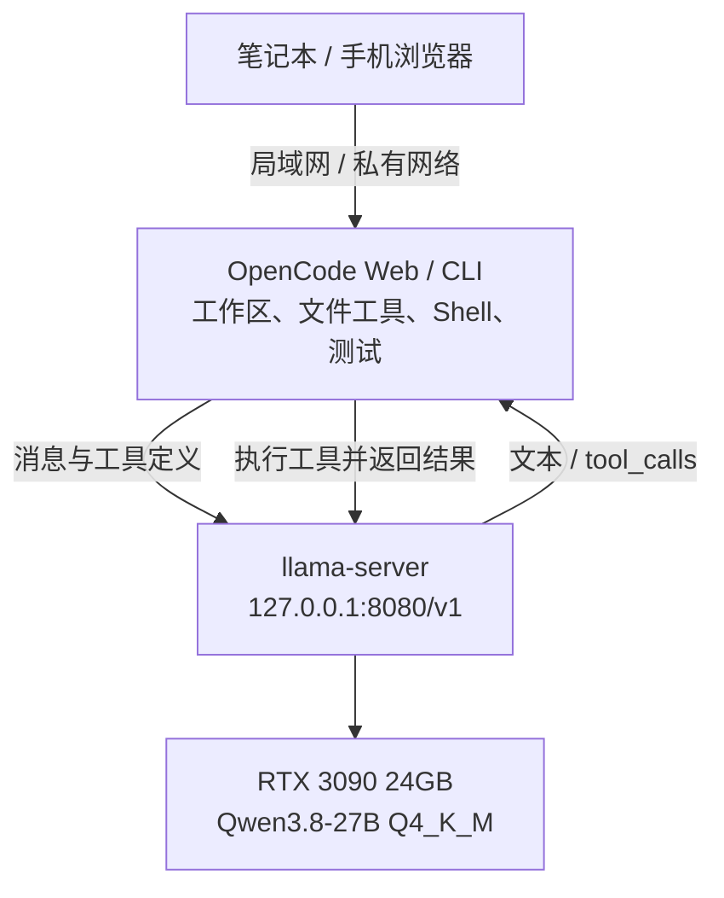

我手上这张 **RTX 3090**，是当年挖以太坊留下来的。现在拿它跑本地模型，也算一次“废物利用”：显卡还是那张显卡，工作换成了驱动编码 Agent。

[上一篇](/zh/blog/setup-opencode-remote-web-ide/)解决了从笔记本、手机接入同一个 OpenCode 工作区的问题。这次，我想把模型也搬到这台主机上，看看现有硬件能把本地 AI 编码工作流做到什么程度。

于是，我们在 **3090 的 24GB 显存**里跑起了 **Qwen3.8-27B Q4_K_M**，通过 llama.cpp 接入 OpenCode。除了确认它能聊天、能调用工具，还让它尝试了四个小型代码任务。

这轮测试让我愿意继续用它：**有明确验收条件的小修复和小功能，它已经能做出有用的补丁。** 同时，输出预算耗尽、任务超时和测试漏掉的边界问题，也说明独立验证仍然很有必要。

下面先讲它实际跑得怎么样，再讲怎样复现。如果想直接动手，可以跳到[部署部分](#复现这套本地编码环境)。

## 为什么选 Qwen3.8-27B

选它的起点，是它在本地模型圈里的热度。Qwen3.8-27B 是本地编码中很受关注的候选之一，也有成绩支撑这种期待：[官方模型卡](https://huggingface.co/Qwen/Qwen3.8-27B#text-performance)报告了 **SWE-bench Pro 61.7** 和 **Terminal Bench 2.1 73.0** 的成绩。前者涉及软件修复，后者涉及终端中的 Agent 任务，和我想用 OpenCode 做的事情比较接近。它们是官方在各自评测配置下报告的结果，让我愿意优先试它。

更实际的理由，是它和手上的硬件匹配。**27B 的 Q4_K_M 权重约 16.8GB**，在这次配置下能完整放进 3090 的 24GB 显存，并给 KV cache 和运行缓冲区留出空间。对这张旧卡来说，模型能力、显存占用和速度之间的平衡，比一味追更大的参数量更有用。

它的 Agent 定位也符合这次需求：我们要让模型读代码、调用工具、根据测试反馈继续修改。[官方介绍](https://github.com/QwenLM/Qwen3.8#introduction)强调了编码、多步 Agent 执行和可调 thinking；这套部署又能通过 llama.cpp 的本地 API 接入 OpenCode，方便把这些能力放进实际工作流。

因此，我把它当作一个“口碑值得关注、硬件也跑得动”的起点。官方榜单的成绩能帮助选候选模型，**Q4 量化后在这张卡上究竟能做多少事，还要看自己的任务和验证结果。** 下面的实测就是为这个问题准备的。

## 这张旧卡，现在负责什么

这套组合里，OpenCode 负责工作区和工具：读文件、修改代码、执行 Shell、运行测试。llama-server 负责模型推理，两者通过本机 API 连接。



模型返回的 `tool_calls` 会交给 OpenCode 执行，工具结果再送回模型，形成下一轮对话。模型 API 本身不会执行终端命令。

硬件是 **RTX 3090 24GB、Ryzen 7 5800X 和 64GB RAM**。我们使用 **llama.cpp b11146 / CUDA 12.8** 和 **OpenCode 2.0.20**，把全部模型层放到 GPU，提供一个生成槽位。

权重取自 [Ollama 的 `qwen3.8:27b-q4_K_M` 标签](https://ollama.com/library/qwen3.8:27b-q4_K_M)，由独立的 llama-server 加载，无需安装 Ollama 服务。本次只加载文本模型，没有测试视觉输入。

最容易混淆的两个设置是：**上下文容量 131,072 tokens，单次输出上限 8,192 tokens**。输入和输出共享上下文；而输出预算还要容纳模型的 reasoning。这一点，后来直接影响了一次代码任务的结果。

## 长上下文能放下，第一次处理却要等

短输入下，这张卡的生成速度约为 **36.4 token/s**。把输入拉到约 120K tokens 后，速度降到 **20.9 token/s**，新请求的首 token 要等约 **三分钟**。

生成之前，模型先要处理你给它的输入。输入越长，前面的等待越明显：

| 实际输入 | 新输入处理速度 | 生成速度 | 新输入首 token 等待 | 缓存续聊首 token 等待 |
| --- | ---: | ---: | ---: | ---: |
| 2,073 tokens | 999 token/s | **36.4 token/s** | 2.75 秒 | 0.46 秒 |
| 16,378 tokens | 995 token/s | **33.5 token/s** | 17.00 秒 | 0.47 秒 |
| 65,537 tokens | 795 token/s | **25.9 token/s** | 83.41 秒 | 0.51 秒 |
| 120,011 tokens | 656 token/s | **20.9 token/s** | 183.01 秒 | 0.63 秒 |

对编码工作流更有用的，是表格的最后一列。缓存续聊复用了几乎整个前缀，只处理 **27–28 个新输入 tokens**，所以即使保留约 120K 上下文，首 token 等待也降到 **0.63 秒**。不过，后续生成仍然要面对长上下文，速度没有恢复到短输入的水平。

这给了我一个很实际的使用方向：尽量保留稳定的会话前缀，按需提供源码。反复开启全新的大上下文请求，会重复支付输入处理的成本。

另一次容量检查成功处理了 **119,968-token 输入**，找到了三个相距很远的值，并回答了后续问题。它验证了这套配置在合成检索任务中的容量；真实编码能否在同样长度下保持质量，还需要另外测试。

显存也接近这张卡的边界。吞吐量测试中，观测到总使用峰值 **22,162 MiB**、最少空闲 **1,943 MiB**，温度最高 **85°C**，其中包含桌面等其他 GPU 用量。配置能跑，但给第二个模型或其他 GPU 重负载留下的余量不多。

<details>
<summary>测量方法、样本数量与原始数据</summary>

所有行都使用同一个 **131,072-token 服务配置**，只改变实际输入长度。主表关闭 thinking，使用合成源码、temperature 0 和 seed 1234；新请求生成 512 tokens，缓存续聊生成 256 tokens，生成文本没有被执行。

生成速度按服务端 decode 计时，不含初次输入处理；首 token 等待按流式 HTTP 客户端计时，包含分词和处理开销。2K 行取三次新请求的中位数，其余长度各测一次新请求和一次续聊。这些是单次配置的测量值，没有建立稳定性区间。GPU 每两秒采样一次。

短请求开启 medium thinking 时另测到约 **35.7 token/s**，其中包括 reasoning tokens。吞吐量不能直接换算成每秒产出多少可用代码。复测脚本测量单请求性能，不包含模型加载时间或多用户吞吐量。

[测量记录](/experiments/qwen3.8-27b-3090/throughput-results.json)和[汇总](/experiments/qwen3.8-27b-3090/throughput-summary.json)可供核对。

</details>

## 真正的考验：让它修四个小项目

我们给它准备了四个小型 Python 仓库：带过期时间的缓存、CSV 账本、增量构建规划器和 SQLite 转账。每个都有书面验收条件，限时八分钟，使用新会话。

为了避免只看 Agent 自己写的测试，我们另外准备了每任务十个独立测试方法，放在它的工作区之外，不把结果反馈给模型。

| 任务 | 独立检查：修改前 → 后 | 耗时 | Agent 新增测试 | 实际结果 |
| --- | --- | --- | ---: | --- |
| 带 TTL 的 LRU 缓存 | 0/10 → **10/10** | 约 3 分 07 秒 | 23 | 完成；本轮最扎实的结果 |
| CSV 账本与退款 | 1/10 → **10/10** | 约 5 分 44 秒 | 40 | 完成；审查发现边界与错误处理遗漏 |
| 增量构建规划器 | 1/10 → **1/10** | 3 分 58 秒 | 0 | 没有修改代码；耗尽单次输出预算 |
| SQLite 原子转账 | 1/10 → **10/10** | 8 分钟截止 | 11 | 候选实现通过检查；未完成最终测试重跑和交付 |

**三个候选实现通过了全部预设独立检查，两个在时限内完成了修改、测试和最终交付。** 转账实现虽然通过检查，Agent 自己却在完成最后一次测试重跑和交付前超时了。这两个数字要分开看。

四个首次候选合计通过 **31/40 个独立测试方法**。构建规划器没有修改代码，其中的一项在原始版本就已通过。这些测试方法也不等难度，因此 31/40 不适合解读成通用编码成功率。

比总分更值得分享的，是下面两个发现。

### 一次失败，来自输出预算

构建规划器读过仓库，却始终没有写出补丁。最后一次响应生成了 **8,192 tokens**，全部是 reasoning，终止原因是 `length`。OpenCode 进程退出码为零，但没有最终答案。

那次请求只有约 **4,985 个输入 tokens**，远没到 128K 上限。这里需要调整的是 thinking 和单次输出预算；增加上下文容量并不能解决已经发生的输出预算耗尽。[终止记录](/experiments/qwen3.8-27b-3090/buildplan-termination.json)保留了这一点。

我们从原始仓库另跑了一次关闭 thinking 的诊断，保留同样的提示、输出预算和时限。它在 **5 分 40 秒**完成，独立检查通过 **9/10**。最后一项失败，是 `load_manifest()` 把原本返回的列表改成了元组，而它的自写测试也接受了这个变化。

这次重试单独报告，不替换首次结果。temperature 1 下的一个额外样本，还不能说明关闭 thinking 普遍更好，但给了后续调参一个值得验证的方向。

### 写了很多测试，也会漏掉问题

账本任务新增了 **40 个测试**，预设独立检查全部通过，代码结构也比较清楚。继续审查时，我们仍发现：Python 默认的 28 位 Decimal 精度，会让一个合法的大额金额加 `0.01` 时发生舍入，违反“不舍入”的验收条件。读取文件过程中出现的 I/O 错误，也可能逃逸为 traceback。

转账任务则暴露了另一种问题：自写的“并发测试”提交一个 future 后立即等待，才提交下一个，实际执行是串行的。我们另外准备的八个并发调用测试通过了，但 Agent 自己的测试没有证明它测到了并发。

审查还发现，目标余额接近 SQLite 有符号整数上限时，加两分钱会让余额变成 `REAL`，同时仍然记录成功。这个极端数值边界应该被拒绝并回滚。

这些探针在评分之后运行，没有追加入原先的 40 项得分。它们让我更关注测试具体覆盖了什么，而不只是新增了多少个测试。缓存实现未发现额外验收缺陷，不过过期清理会扫描整个缓存，适用结论仍限于本次小型任务。

<details>
<summary>代码测试协议与补充结果</summary>

每个仓库有三个固定公开测试。独立检查在对应任务运行前准备；评估器不修复候选生产代码，Agent 也没有改动受保护的验收条件、公开测试或配置。

首次任务串行运行，使用 medium thinking 和 8,192-token 单次输出上限。允许仓库内文件工具和受限的本地测试命令，不使用网络工具、子 Agent 或云端模型回退。基础设施中止的启动未计入得分。缓存和账本耗时由记录时间恢复，属于近似值。

评估器随后运行公开测试与 Agent 新增测试，缓存 **26/26**、账本 **43/43**、转账 **14/14** 通过。转账的这次绿灯发生在 Agent 超时之后；原始构建规划器仍未通过三个公开测试。关闭 thinking 的构建规划器诊断通过了 **47/47** 个公开及自写测试，但仍有上述独立检查失败。

这轮只测试了四个刻意限定范围的小型 Python 仓库，没有测跨随机种子的可靠性、大型生产仓库、Q4 与更高精度权重的质量差异，或 64K / 128K 下的实际编码质量，也没有做模型间的同条件比较。[代码任务汇总](/experiments/qwen3.8-27b-3090/coding-summary.json)保留了评分与审查探针。

</details>

## 我会怎样用这张卡继续干活

我会把范围明确的小修复和小功能交给它，提前写清验收条件，再检查实际 diff、独立测试和最终交付。它已经展示了跨文件修改、补充回归覆盖、修正部分自查问题的能力。

较长的任务，我会留意 reasoning 有没有挤占输出预算，以及整个流程是否超时。数值边界、并发和错误处理，仍然需要审查。下一轮实验会保留同一批任务和检查，增加重复运行，再比较 thinking 与输出预算的组合。

从挖以太坊到跑本地编码 Agent，这张 3090 有了新的用途。已经有类似硬件的话，可以先从一个有清楚验收条件的小任务开始，看看自己的工作流能从中获得多少帮助。

## 复现这套本地编码环境

下面是实际使用的部署路径。完整配置已经放在[下载包](/experiments/qwen3.8-27b-3090/reproduction-kit.zip)里，正文保留启动与验收步骤，其余参数可以展开查看。

### 1. 启动模型服务

在 Ubuntu 上准备 NVIDIA 驱动、`curl`、`unzip`、Python 3 和正常用户会话，然后运行：

```bash
mkdir -p ~/local-qwen && cd ~/local-qwen
curl -fL https://zjshen14.github.io/experiments/qwen3.8-27b-3090/reproduction-kit.zip -o kit.zip
unzip kit.zip
bash setup.sh
./run-server.sh
```

`setup.sh` 下载并校验 GGUF 和 [llama.cpp b11146 CUDA 12.8 发布包](https://github.com/ggml-org/llama.cpp/releases/tag/b11146)。下载总量约 **17.6GB**，还需要运行时解压空间；ZIP 本身不含权重。这条路线使用预编译运行时，无需编译 CUDA 开发工具链，也不会安装系统服务或改动 OpenCode 全局配置。

服务就绪后，在另一个终端验证 API：

```bash
curl -f http://127.0.0.1:8080/health
curl -f http://127.0.0.1:8080/v1/chat/completions \
  -H 'Content-Type: application/json' \
  -d '{"model":"qwen3.8-27b","messages":[{"role":"user","content":"Reply with OK."}],"max_tokens":64,"chat_template_kwargs":{"enable_thinking":false}}'
```

服务监听 `127.0.0.1:8080`，本机请求不需要真实 API key。客户端若强制要求填写，可以用非秘密占位值 `local`，但它不是访问控制；这个无认证端口应保持在回环地址。

<details>
<summary>完整实验配置、启动参数和后台运行</summary>

| 项目 | 实测配置 |
| --- | --- |
| 系统 | Ubuntu，Linux x86-64 |
| GPU | NVIDIA RTX 3090，24GB 显存 |
| CPU / 内存 | Ryzen 7 5800X / 64GB RAM |
| 权重 | Qwen3.8-27B，Q4_K_M，16,810,714,464 字节 |
| 推理引擎 | llama.cpp **b11146**，CUDA 12.8 预编译运行时 |
| Agent | OpenCode **2.0.20** |
| 上下文 / 单次输出上限 | **131,072 / 8,192 tokens**；输入与输出共享上下文 |
| KV cache | K、V 均为 **q8_0** |
| GPU / 并发 | 全部模型层放到 GPU；**一个生成槽位** |
| 其他参数 | Flash attention；batch 512 / microbatch 256 |
| 编码任务的 thinking | 开启，**medium** |

Q4_K_M 描述权重量化，q8_0 描述 KV cache 量化。约 16.8GB 的权重文件之外，还要为缓存、计算缓冲区和桌面应用保留显存。完整脚本见包内 `run-server.sh`，下面是核心参数片段：

```bash
llama-server \
  --model models/Qwen3.8-27B-Q4_K_M.gguf \
  --alias qwen3.8-27b \
  --host 127.0.0.1 --port 8080 \
  --ctx-size 131072 --parallel 1 \
  --n-gpu-layers all --fit off \
  --flash-attn on \
  --cache-type-k q8_0 --cache-type-v q8_0 \
  --batch-size 512 --ubatch-size 256 \
  --jinja --reasoning-format deepseek --reasoning-preserve \
  --no-context-shift --no-mmproj --metrics
```

包内脚本会设置动态库路径并调用实际二进制。如果其他应用也需要显存，可停止服务后用 `MODEL_CONTEXT=65536 ./run-server.sh` 启动 64K 配置。本文测量始终使用 128K 配置。

希望关闭启动终端后继续运行时，先结束前台服务，再执行：

```bash
mkdir -p logs
systemd-run --user --collect --unit=qwen-local \
  --property="WorkingDirectory=$PWD" \
  --property="StandardOutput=append:$PWD/logs/server.log" \
  --property="StandardError=append:$PWD/logs/server.log" \
  "$PWD/run-server.sh"
# 停止：systemctl --user stop qwen-local
```

这是临时用户服务，重启后需要重新启动。退出整个用户登录会话后的存活取决于用户服务管理器配置，本次未验证。

</details>

### 2. 配置 OpenCode

把下载包里的 `opencode.json` 放到项目根目录，或合并 Provider 内容到 `~/.config/opencode/opencode.json`。这份配置在 **OpenCode 2.0.20** 上验证过：模型 ID 为 `local-qwen/qwen3.8-27b`，API 地址为 `http://127.0.0.1:8080/v1`。

<details>
<summary>查看完整 OpenCode Provider 配置</summary>

```json
{
  "$schema": "https://opencode.ai/config.json",
  "model": "local-qwen/qwen3.8-27b",
  "providers": {
    "local-qwen": {
      "name": "Local Qwen",
      "package": "@opencode/ai/providers/openai-compatible",
      "settings": {
        "baseURL": "http://127.0.0.1:8080/v1"
      },
      "models": {
        "qwen3.8-27b": {
          "name": "Qwen3.8 27B — 128K",
          "capabilities": {
            "tools": true,
            "input": ["text"],
            "output": ["text"]
          },
          "limit": { "context": 131072, "output": 8192 },
          "compatibility": { "reasoningField": "reasoning_content" },
          "body": {
            "chat_template_kwargs": {
              "enable_thinking": true,
              "reasoning_effort": "medium"
            }
          }
        }
      }
    }
  }
}
```

这份实测配置使用 `providers` / `package` / `settings`；[在线 Provider 文档](https://opencode.ai/docs/providers/#custom-provider)展示过 `provider` / `npm` / `options`。如果安装版本不同，请按实际 schema 调整，避免混用两套结构。

</details>

先启动模型服务，再重启 OpenCode；本次安装也通过 `opencode reload` 重载过配置。已有会话可能保留旧模型，用 `/models` 选择 `local-qwen/qwen3.8-27b`。

如果沿用上一篇的 Web 模式，在目标项目目录里启动，并给它另一个端口：

```bash
export OPENCODE_SERVER_PASSWORD='replace-with-a-strong-password'
opencode web --hostname 127.0.0.1 --port 4096
```

**8080 给模型服务，4096 给 OpenCode。** 两者在同一台机器上时，Provider 使用回环地址；远程浏览器访问的是 OpenCode。OpenCode 若在另一台机器或容器里，`127.0.0.1` 会指向它自己的环境，需要另配私有网络连接。局域网或远程访问的绑定与认证方式见[上一篇](/zh/blog/setup-opencode-remote-web-ide/)。

### 3. 确认工具调用，再跑自己的任务

先确认普通回复，再创建一个无敏感内容的文件，让 Agent **调用 `read` 工具读取**并返回内容。本次两项都通过，服务端还通过了合成工具调用往返和流式工具调用检查。

要复测吞吐量，让模型服务保持空闲，并指定一个新的输出目录：

```bash
python3 benchmark_throughput.py --report-dir reports/throughput-new-run
```

接下来，就可以让它处理一个范围明确的小任务，再用独立测试和代码审查验收。

## 配置、数据和复现材料

- [配置与测量包 ZIP](/experiments/qwen3.8-27b-3090/reproduction-kit.zip)：下载校验、完整启动脚本、OpenCode 配置、吞吐量脚本和数据；不包含权重或编码任务完整夹具。
- [实验说明](/experiments/qwen3.8-27b-3090/README.txt)、[吞吐量测量记录](/experiments/qwen3.8-27b-3090/throughput-results.json)、[代码任务汇总](/experiments/qwen3.8-27b-3090/coding-summary.json)。附件已去除实验日期、绝对时间戳、时区、个人路径和会话标识，保留性能测量、评分及审查探针。
- [Qwen 官方模型卡](https://huggingface.co/Qwen/Qwen3.8-27B)、[固定版本 llama-server 文档](https://github.com/ggml-org/llama.cpp/blob/b11146/tools/server/README.md)、[OpenCode Provider 文档](https://opencode.ai/docs/providers/)。上游资料提供选型背景、官方评测和部署说明；本文的本机性能及四个代码任务结论来自附带的实验记录。
