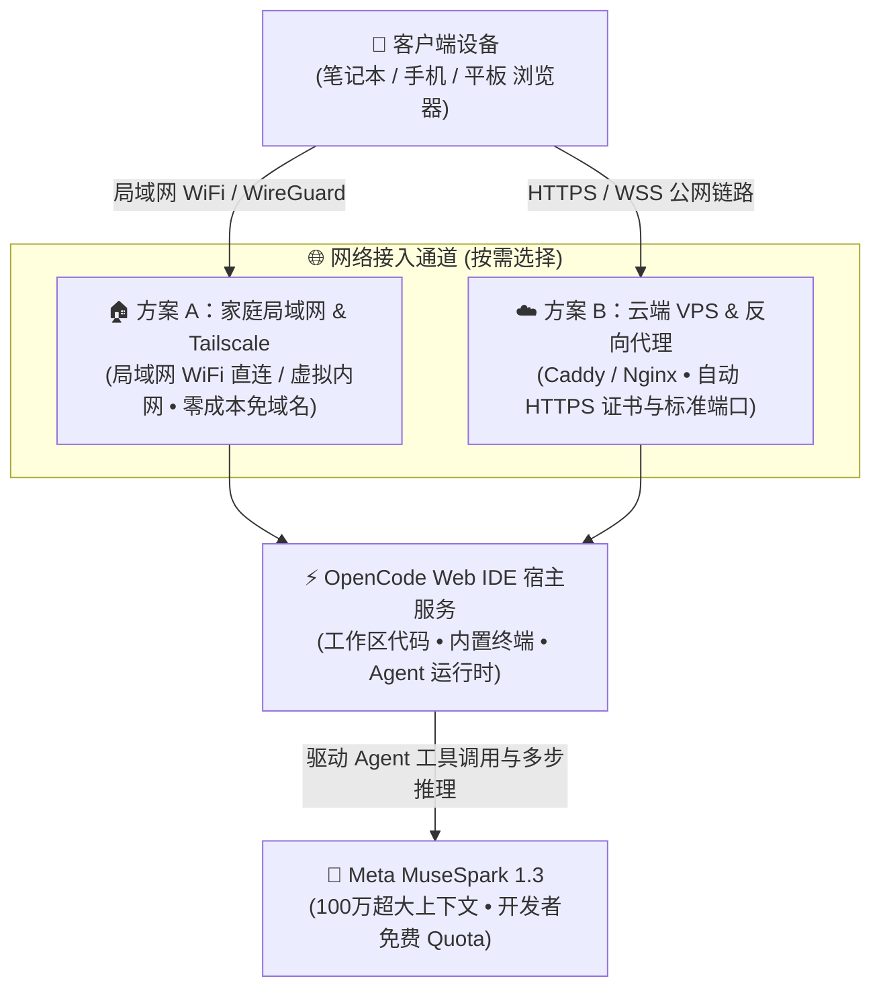

在最近的 **Agent Hosting** 项目中，我们遇到了一个非常典型的场景：如何让自主 AI Agent 拥有一个 **7×24 小时常驻、不依赖单台本地机器、且能随时从任何设备打开浏览器进行操作与监控的 Web IDE 环境**？

很多朋友在本地跑 Agent 时都有类似痛点：
- 笔记本一关盖子，跑了半个小时的长任务直接断掉；
- 外出时临时想看一眼 Agent 的进展或调个参数，手机或随身轻薄本上根本没有本地开发环境；
- API Token 散落在各个设备上，环境配置频繁漂移。

为了解决这个问题，我们搭建了基于 **OpenCode** 的 Web IDE 方案，让它不仅能在云端服务器上运行，也可以直接部署在**家里的台式机、Mac mini 或 Homelab 主机**上。更关键的是，Meta 最新推出的 **MuseSpark 1.3 (Muse Spark 1.3)** 目前在 OpenCode 上**限时免费**（Muse Spark 1.3 Contributor Free），不用申请任何 API Key，打开就能用。MuseSpark 专为 Agentic 长期复杂任务打造，拥有 100 万超长上下文，相比上代减少了约 20% 的工具调用开销与 25% 的 Token 消耗，接入后能以极低成本甚至零成本流畅跑通整套自主编码 Agent 流程。

今天这篇文章就把我们的实践经验梳理成教程：**无论你手头是否有公网域名，无论是在家里局域网躺在沙发上用手机/笔记本协同，还是在云端 VPS 上全天候托管**，都能快速落地一套属于自己的 Agent 工作台。

---

## 整体架构设计

这套方案支持两种典型的接入形态，你可以根据自己的设备条件灵活选择：



### 为什么关注 HTTP / WebSocket 支持？
OpenCode 这类 Web IDE 在浏览器中运行时，绝不仅仅是加载几个静态 HTML/JS 页面：
1. **持久 WebSocket 通信**：网页内置终端（Terminal）、代码语言服务（LSP）和 Agent 的实时流式输出，全部重度依赖 WebSocket 连接。如果网络链路未正确升级协议，终端会直接报 `Connection failed`。
2. **移动端协同**：只要网络打通，不管是坐在书房的笔记本，还是躺在客厅沙发上的 iPhone/iPad，都能随时接入同一个工作区和同一个执行中的 Agent 任务。

---

## 第一步：启动 OpenCode 服务

首先在你的宿主机（家里的 Linux/Mac/Windows WSL2，或者云端 VPS）上安装并启动 OpenCode。

> ⚠️ **先设密码，再开放访问**：OpenCode Web 界面可以直接在宿主机上执行任意 Shell 命令，谁能打开这个页面，谁就拿到了你机器的终端权限。无论局域网还是公网，都请通过 `OPENCODE_SERVER_PASSWORD` 环境变量开启 HTTP Basic 认证（用户名默认为 `opencode`，可用 `OPENCODE_SERVER_USERNAME` 修改）。

### 1. 监听地址的选择
`opencode web` 会启动带浏览器界面的服务，并以**当前目录**作为工作区（注意：`opencode serve` 只启动无界面的 API 服务，不是我们要的 Web IDE）。先进入项目目录，再根据访问方式选择监听地址：
- **家庭局域网多设备访问**：绑定到 `0.0.0.0`，这样局域网内的手机、平板和笔记本才能连上：
  ```bash
  cd /path/to/your/workspace
  export OPENCODE_SERVER_PASSWORD='换成你的强密码'
  opencode web --hostname 0.0.0.0 --port 8080
  ```
  启动后 OpenCode 会同时打印本机地址和局域网访问地址（如 `http://192.168.1.100:8080`）。
- **云服务器（前置反向代理）**：如果前面有 Nginx/Caddy 网关挡着，建议仅监听本地 `127.0.0.1`，让所有流量都必须经过代理：
  ```bash
  cd /home/ubuntu/workspace
  export OPENCODE_SERVER_PASSWORD='换成你的强密码'
  opencode web --hostname 127.0.0.1 --port 8080
  ```

### 2. 守护进程配置（以 Linux systemd 为例）
为了保证终端关闭或主机重启后服务依然常驻，可以配置一个简单的 **systemd** 服务。

先把密钥放进一个只有 root 可读的环境文件，避免明文写在所有用户都能读到的 unit 文件里（如果第三步选择使用自己的 Meta API Key，也放在这里）：

```bash
sudo tee /etc/opencode.env >/dev/null <<'EOF'
OPENCODE_SERVER_PASSWORD=换成你的强密码
EOF
sudo chmod 600 /etc/opencode.env
```

然后创建服务文件：

```ini
# /etc/systemd/system/opencode.service
[Unit]
Description=OpenCode Web IDE Server
After=network.target

[Service]
Type=simple
User=ubuntu
WorkingDirectory=/home/ubuntu/workspace
EnvironmentFile=/etc/opencode.env
# 云服务器 + 反向代理：保持 127.0.0.1；家庭局域网直连：改为 0.0.0.0
# opencode 的实际路径可用 `which opencode` 确认
ExecStart=/usr/local/bin/opencode web --hostname 127.0.0.1 --port 8080
Restart=always
RestartSec=5

[Install]
WantedBy=multi-user.target
```

启动并设置开机自启：
```bash
sudo systemctl daemon-reload
sudo systemctl enable --now opencode
sudo systemctl status opencode
```

---

## 第二步：网络连接与访问配置（按需选择）

**并不是每个人都需要去专门买一个公网域名**。现实中最常见的其实是家庭局域网或者虚拟局域网。以下两种路径任选其一：

### 方案 A：家庭局域网直连（无需域名，最常用、零成本）

如果你只是想在家里工作，利用书房的主机当性能服务器，人在客厅或卧室用轻薄本、手机随手连：

1. **查看主机的局域网 IP**：
   - Linux / macOS：终端执行 `ifconfig` 或 `ip route`（通常为 `192.168.1.xxx` 或 `192.168.31.xxx`）；
   - 或者使用 mDNS 主机名（比如你的 Mac 叫 `mini.local` 或主机叫 `homelab.local`）。
2. **手机/笔记本直接打开**：
   - 确保设备连在同一个家里的 WiFi 下；
   - 在手机 Safari、平板或笔记本 Chrome 里直接输入：
     ```text
     http://192.168.1.100:8080
     # 或
     http://homelab.local:8080
     ```
   - 浏览器会弹出登录框，输入用户名 `opencode` 和第一步设置的密码即可进入；
   - 搞定！没有任何域名或证书开销，内网毫秒级延迟，流量不出家门。

> 💡 **没域名又想在外网连回家里？神器 Tailscale**  
> 如果你想外出时也能访问家里的 OpenCode，但家里没有公网 IP 也没有购买域名，最优雅的解法是使用 **Tailscale**（全免费）：  
> 在家里主机上运行 `tailscale up`，手机和笔记本也装上 Tailscale App。Tailscale 会利用 WireGuard 建立端到端加密的虚拟私网，并给主机分配一个内网 IP（例如 `100.x.y.z`）。在外面连上手机流量，直接访问 `http://100.x.y.z:8080`，随时随地安全直达家里的 IDE！

---

### 方案 B：云端 VPS + 反向代理（拥有云服务器与独立域名）

如果你在阿里云、腾讯云、AWS 等租了公网 VPS，并拥有自己的独立域名（例如 `ide.example.com`），那么配置前置反向代理能够带来自动化 HTTPS 证书与更标准的安全管理：

#### 选项 1：使用 Caddy（极简，自带自动申请与续签 HTTPS）
```text
# /etc/caddy/Caddyfile
ide.example.com {
    reverse_proxy 127.0.0.1:8080
}
```
保存后执行 `sudo systemctl reload caddy`，Caddy 会自动通过 Let's Encrypt 签发 SSL 证书并完整透传 WebSocket。

#### 选项 2：使用 Nginx（传统经典方案，支持复杂定制）
```nginx
# /etc/nginx/sites-available/opencode.conf
server {
    listen 80;
    server_name ide.example.com;
    return 301 https://$host$request_uri;
}

server {
    listen 443 ssl http2;
    server_name ide.example.com;

    # SSL 证书路径（可使用 certbot 生成）
    ssl_certificate /etc/letsencrypt/live/ide.example.com/fullchain.pem;
    ssl_certificate_key /etc/letsencrypt/live/ide.example.com/privkey.pem;

    # 关键：调整超时时间与请求体上限，避免耗时 Agent 任务中断
    client_max_body_size 100M;
    proxy_read_timeout 86400s;
    proxy_send_timeout 86400s;

    location / {
        proxy_pass http://127.0.0.1:8080;

        # 核心：必须配置以下三行以支持 WebSocket 终端与实时流式传输
        proxy_http_version 1.1;
        proxy_set_header Upgrade $http_upgrade;
        proxy_set_header Connection "upgrade";

        # 传递真实客户端信息
        proxy_set_header Host $host;
        proxy_set_header X-Real-IP $remote_addr;
        proxy_set_header X-Forwarded-For $proxy_add_x_forwarded_for;
        proxy_set_header X-Forwarded-Proto $scheme;
    }
}
```

测试并重载 Nginx：
```bash
sudo nginx -t && sudo systemctl reload nginx
```
此时通过配置好的域名 `https://ide.example.com` 即可直接访问，浏览器会弹出 OpenCode 的登录框。

> ⚠️ 反向代理本身**不做任何身份验证**，它只是把公网流量转发给 OpenCode。务必确认第一步的 `OPENCODE_SERVER_PASSWORD` 已生效（直接访问时应弹出登录框），否则等于把一台服务器的终端公开到了互联网上。

---

## 第三步：接入 Meta MuseSpark 1.3 开发者免费 Quota

在 OpenCode 中驱动 Agent，不可或缺的是底层的大语言模型。

Meta 在 2026 年 9 月推出的 **MuseSpark 1.3** 相比以往版本带来了质的飞跃：
- **专为 Agent 优化**：在单一长线程中支持多步骤自主规划，能主动识别上下文漏洞并调用工具弥补；
- **极高的执行效率**：代码生成任务中，比 1.2 版本减少了约 20% 的 Tool Calls 和 25% 的 Token 开销；
- **100 万 Token 超大上下文**：跑大型代码库重构或读一整个 Repo 时无需担心 Context 溢出；
- **免费使用渠道**：OpenCode 自带的模型服务 **OpenCode Zen** 限时免费提供 **Muse Spark 1.3 Contributor Free**，在 OpenCode 里**无需注册、无需任何 API Key** 就能直接选用。

> ⚠️ **免费的代价**：Contributor Free 属于 Meta 的 Contributor（贡献者）计划，你的 Prompt 和模型输出**会被授权给 Meta 用于训练后续模型**。适合个人实验和开源项目，不要把公司代码、密钥或隐私数据交给它。另外它是**限时免费**，具体政策以 [OpenCode Zen 文档](https://opencode.ai/docs/zen/) 为准。

### 1. 零配置：直接选用免费模型（推荐）
OpenCode 在没有配置任何 Key 的情况下，会自动加载 OpenCode Zen 中的免费模型，所以这一步其实**什么都不用配**：

1. 打开 Web IDE，在模型选择器中（或在对话框输入 `/models`）选择 **Muse Spark 1.3 Contributor Free**；
2. 发一条消息，比如让 Agent 读一下工作区里的某个文件并总结。能正常回复并调用工具，就说明模型与 Agent 环境已经打通。

如果希望每次启动都默认使用它，可以在工作区根目录（或全局配置 `~/.config/opencode/opencode.json`）中写入：

```json
{
  "$schema": "https://opencode.ai/config.json",
  "model": "opencode/muse-spark-1.3-contributor-free"
}
```

也可以在终端确认模型已经可用：

```bash
opencode models | grep muse-spark
```

### 2. 进阶：使用自己的 Meta API Key
如果你不希望数据被用于训练，或者需要更稳定的调用额度，可以在 [Meta 开发者平台](https://dev.meta.ai/) 申请 API Key。OpenCode 内置了 `meta` Provider，不需要手写任何 Provider 配置，可选模型有：

- `meta/muse-spark-1.3`：标准版，每百万 Token 输入 $1.25 / 输出 $4.25，数据不用于训练；
- `meta/muse-spark-1.3-contributor`：Meta 官方 Contributor 折扣价，每百万 Token 输入 $0.10 / 输出 $0.20，同样授权 Meta 使用数据训练。

把 Key 追加到第一步创建的 `/etc/opencode.env`，然后重启服务：

```bash
echo 'META_MODEL_API_KEY=your-meta-api-key' | sudo tee -a /etc/opencode.env >/dev/null
sudo systemctl restart opencode
```

之后在模型选择器中选择 `meta/muse-spark-1.3` 即可。

---

## 第四步：多端实战体验：手机 + 笔记本协同

搭建完毕后，最爽的当属工作流的跨设备自由度：

1. **主力开发场景（Laptop 工作台）**：
   在轻薄笔记本浏览器里直接打开 IDE（局域网 `http://192.168.1.100:8080` 或云端域名），敲代码、调试语法高亮、看 Git Diff，由于实际负载全部跑在后台主机上，笔记本风扇不转、电池能续航一整天，体验与本地桌面版 VS Code / IDE 几乎没有任何区别。
2. **挂机与长时间后台任务（Host Native）**：
   让 Agent 自动检索文档、跑爬虫或重构大文件时，直接把命令扔在 IDE 内置的终端里。合上笔记本盖子走人，主机依然在全速后台运算。
3. **客厅沙发 / 床头碎片协同（Phone / Tablet）**：
   晚上躺在沙发或床上时，手边只有手机或 iPad，连上家里同一个 WiFi 就能秒开 Web IDE。不仅能随时盯一眼后台跑出来的中间产物和测试日志，还能用手机软键盘补上一条 Prompt 推进下一步任务：“*帮我把刚才跑挂了的单元测试修一下并重新执行*”。出门在外时，配合 Tailscale 依然可以随时掏出手机接入。

---

## 结语与注意事项

通过 **宿主环境（家庭主机/云端 VPS）+ 网络通道（局域网/Tailscale/反向代理）+ Meta MuseSpark 1.3 免费额度** 的组合，我们以极低的门槛获得了属于自己的自主 Agent 实验台。

最后提两个安全层面的实用建议：
- **始终开启密码认证**：Web IDE 等同于一个远程终端。即使只在家庭局域网内使用，也建议保留 `OPENCODE_SERVER_PASSWORD`（同一 WiFi 下的其他设备、访客都能扫到你的端口）；映射到公网或部署在 VPS 上时更是必需项，还可以在 Nginx 层额外加上 IP 白名单（`allow` / `deny`），谨防终端权限被恶意扫描；
- **合理利用 1M 上下文与 Quota**：MuseSpark 1.3 的 1M Context 极度强大，但在免费额度下也建议做好上下文修剪与 Agent 单步超时控制。

如果你也在探索 Agent Hosting 或多设备无缝协同开发，完全不需要等待买域名或租高配云机，先用家里的闲置电脑跑起来，立刻就能享受多端自由协同的快乐！如果在配置过程中遇到任何问题，欢迎随时交流探讨。
